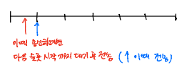
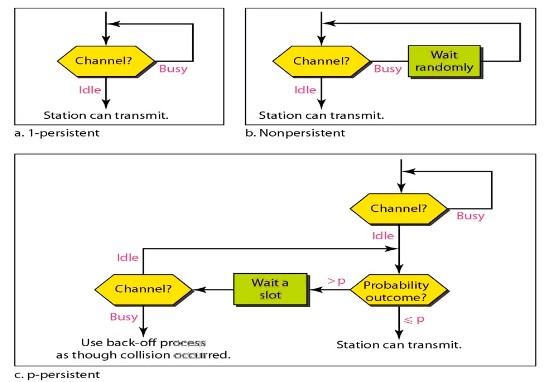
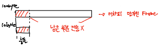
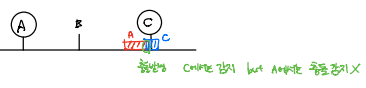

# Computer_Network_임의접근(2)

## slotted ALOHA
- ALOHA

.assets/image-20210502150547121.png)

- slotted ALOHA

.assets/image-20210502150339596.png)

- 시간을 슬롯 형태로 분할

- 슬롯의 시작 시간에만 데이터 전송

- 나머지는 ALOHA와 동일

- ALOHA는 complete, partial collision 둘 다 발생

- slotted ALOHA는 complete collision만 발생

- Vulnerable Time(충돌 발생할 수 있는 시간, 구간) : Tfr (하나의 프레임 보내는 시간)

  - ALOHA => 2Tfr
  
- Throughput
  
  - S = G*e-G
  - Smax = 0.368 (G=1)
  - ALOHA => Smax = 0.184
  
  
## CSMA

- 전송 전에 다른 곳에서 전송하는지 채널을 감지 (선 감지 후 전송)

- 채널을 확인해보는 것을 **Carrier Sense**라 한다

- 채널이 비어 있을 때(Idle) 전송을 시작, 다른 Station에서 전송중임을 감지(busy)하면 전송 안함

- 채널이 비어 있음을 확인하고 전송해도 충돌 존재

  - 이유: propagation delay (전파지연시간) 때문에
    - propagation delay: Sender에서 Receiver에 도달하는 데 걸리는 시간

  .assets/image-20210502151530304.png)

  - 예시

      - A에서 채널 감지 후 Idle 상태 확인 => 전송 시작
      - B와 C의 Carrier Sense결과: busy
      - A의 전송 신호가 E에 도달하기 전에 E에서 전송을 위해 채널을 감지 => Idle
      - E도 전송 시작
      - A와 E 전송 충돌 발생

.assets/image-20210502151945905.png)

- 예시
  - A에서 채널 감지 후 Idle 상태 확인 => 전송 시작
  - A의 신호가  Z에 도달하기 전에 Z의 Carrier Sense: Idle => Z도 전송 시작
  - 충돌 발생
  - Z는 t4,  A는 t5에서 충돌을 감지

.assets/image-20210502152210070.png)

- Vulnerable Time(충돌 발생할 수 있는 시간, 구간) : propagation time

### Persistence Methods

> Carrier Sense 결과 busy일 때, idle일때 동작 방법

.assets/image-20210502152629397.png)

#### 1-persistent

- Carrier Sense 결과가 busy라면 계속해서 idle 될 때까지 계속 Carrier Sense를 수행
- idle 상태 되자마자 전송 시작
- 충돌 가능성 높음

#### nonpersistent

- Carrier Sense 결과가 busy라면 random backoff(랜덤 시간 대기) 후 다시 Carrier Sense
- Carrier Sense 결과 idle일 때 전송 시작
- 다른 Station의 전송이 끝나자마자 Carrier Sense를 하지 않아 비는 시간 존재 => 비효율적

#### p-persistent

- Carrier Sense 결과가 busy라면 1-persistent와 같은 수행
- idle일 경우 난수(r) 생성
  - r < p(확률) 이면 전송 시작
  - r >= p이면 특정시간 대기 후 다음 슬롯에서 다시 Carrier Sense
  - 위의 동작 반복
- 충돌 확률 낮다
- 1-persistent는 idle일 때 전송 확률이 p=1(100%)인 p-persistent로 볼 수 있음
  - p-persistent는 idle일 때 전송확률이 p*100%

- 동작과정

## CSMA/CD

> CSMA with Collision Detection

- 전송 전 채널 감지 후 idle이면 전송, 전송 후 해당 프레임이 충돌 났는지 충돌 감지 수행
- 충돌 발생 감지 시 충돌난 프레임 전송 중단
  - complete collision이든 partial collision이든 못쓰는 프레임인건 마찬가지
- 유선 LAN에서 사용

- 최소 프레임 크기: **Tfr >= 2Tp (propagation time*2)**
  - 프레임 전송 중이어야 충돌을 감지할 수 있음
  - A에서 충돌 감지하려면 A -> C -> A 크기만큼의 프레임 크기 필요
    -  예제: 두 Station 거리가 30만km, 전송 속도는 10bps일 때 최소 프레임크기는?
    - 답: 20bits (A -> C: Tp = 1 sec, A->C->A: 2 sec => A는 2초동안 전송중이어야함 => 1초에 10bits 전송 => 최소프레임크기는 10 * 2 = 20bits)

.assets/image-20210502154925267.png)

- 동작과정

  - 프레임 전송 => persistence methods =>충돌 발생
  - 전송 중단하고 다른 Staion들에게 Jamming Signal 전송(충돌 발생 알림)
  - exponential random backoff 후 다시 전송 (backoff 할 때마다 backoff count(K) += 1)
  - 전송 실패할 때마다 해당 프레임의 최대 대기시간은 e만큼 늘어남 (n번 backoff => 0 ~ en)
  - backoff count는 최대 16까지 16넘어가면 해당 프레임 버림
  - 전송 성공 시 backoff count = 0으로 초기화

  

.assets/image-20210502155449622.png)

- 충돌 감지 => 충돌 시 에너지 레벨은 거의 2배가 된다.

## CSMA/CA

> CSMA with Collision Avoidance

- 충돌 회피법

- 주로 무선 LAN에서 사용
- CSMA/CD는 무선에서 사용 불가 => 무선환경에서는 건물, 다른 전파에 의해 충돌 에너지 레벨이 2배가 되지 않아서 충돌을 감지 할 수 없음(에너지 레벨이 더 낮은 경우도 발생)

.assets/image-20210502155920623.png)

- 충돌 회피 방법 3가지
  - Inter Frame Space(IFS)
    - 충돌 방지를 위해 대기하는 시간
  - Contention Window
    - slot으로 분할
    - window안에 slot 수는 binary exponential random backoff를 따른다
    - backoff는 16번까지, 넘어가면 버림
    - 무조건 window전부를 기다리는 것은 아니고 각 slot마다 station에서 확인
  - Acknowledgement
    - 전송 잘 받았을 때 응답(ACK)
    - ACK를 받은 후 다음 프레임 전송

.assets/image-20210502160255317.png)

- 동작과정
  - Carrier Sense => busy => idle 될 때까지 Carrier Sense 반복
  - idle이면 IFS만큼 대기(1차 충돌 회피, 다른 Station에서 전송 중일 수있음 propagation delay)
  - Contention window slot마다 carrier sense, idle이면 전송(2차 충돌 회피) => 최대 Contention window크기 만큼 대기
  - 전송 후 Timer 시작, ACK응답 기다림
  - 정해진 시간안에 ACK 못 받으면 충돌난 것으로 간주 => backoff, contention window크기 늘어남
  - ACK 받았으면 다음 프레임 전송

## Controlled Access 접근 제어

> 접근을 제어하여 충돌을 없앰

### Reservation

.assets/image-20210502160717913.png)

- 데이터 보내기 전에 예약
- 데이터 전송을 원하면 예약 프레임이 왔을 때 데이터 보낸다는 의사를 필드에 씀
- 예약한 Station만 전송 가능

### Polling

- 하나의 primary station 존재
- 나머지는 secondary station
- **주체는 primary**

#### select

- primary가 secondary에게 전송 시
- 데이터 보낼 station에게 데이터 받을 수 있는 지 물어봄

#### poll

- secondary가 primary에게 전송 시
- primary가 station들에게 자신에게 보낼 데이터 있는지 물어봄

#### 장점

- 호스트가 터미널을 선택하여 통신하기 때문에 충돌 없음
- 하나의 회선 이용 => 비용 절감

#### 단점

- 물어보고 전송 => 느림

### Token Passing

.assets/image-20210502161143192.png)

- Token 메시지(전송 권한)을 돌린다
- Token을 가지고 있는 station만 전송 가능
- 논리적/물리적으로 Ring구조를 가짐

- 구조 종류

.assets/image-20210502161323815.png)

