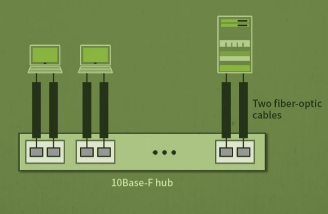
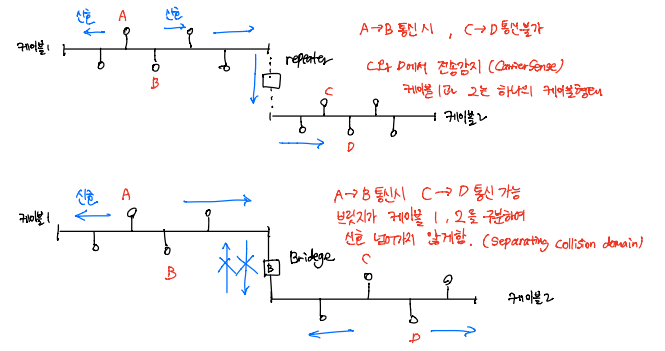

# Computer_Network_표준이더넷

## LAN

> Local Area Network

- 한 건물이나 캠퍼스 (가까운 지역) 내에 구성된 컴퓨터 네트워크
- LAN 구분: 관리영역 또는 관리 주체

## IEEE 표준 프로토콜

- IEEE 학회에서 만든 표준 프로토콜

- **이더넷(Ethernet)**: 매체에 여러 개의 컴퓨터가 접속할 때 사용하는 프로토콜, 유선 LAN에서 사용되는 대표적인 프로토콜

- LAN은 DataLink 계층, 2개의 부계층이 존재
  - Media Access Control(MAC)
    - 매체의 특성과 운용 방식(물리계층과 연관)에 따라 여러개의 프로토콜 존재 (Ethernet, token Ring, token Bus, CSMA/CA, CSMA/CD 등)
    - 여러 단말들의 공유 매체(채널) 사용에 대한 단말간 충돌/경합 발생 제어(한정된 자원을 효율적으로 관리)
  - Logical Link Control(LLC)
    - 매체(망의 토폴로지)에 관계없이 공통적으로 해야할 기능을 제공하는 계층 =>에러제어 (필요시 흐름제어도 함)
    - 모든 LAN에서 공통 계층

- IEEE 802 working group

## Ethernet

### MAC 프레임

> 이더넷 프레임

#### 구성

- Preamble
  
  - 프레임 곧 도착하니 준비하라는 의미
- Start Frame Delimeter(SFD)
  
  - 프레임의 시작을 알림
- Destination Address(DA)
  
  - 목적지 주소
- Source Address(SA)
  
  - Sender  주소
- Length or Type
  
  - 다음에 오는 데이터 필드의 길이 또는 네트워크 계층(3계층) 프로토콜 종류
- Data and Padding
  
  - 전송할 데이터
  - 최소 46byte ~ 최대 1500byte
  - MAC 프레임 최소: 46 + 18(6+6+2+4, preamble, SFD제외) = 64byte
  - MAC 프레임 최대: 1500 + 18 = 1518byte
- Cyclical Redundancy Check(CRC)
  
  - 에러 검출 기능 수행(사용자가 보내는 데이터 부분에 에러가 있는지 확인)
- Preamble과 SFD는 MAC 프레임에 포함하지 않는 경우도 있다
  
  - 하드웨어에서 비트 손실이 발생할까봐 임의 필드로 사용하기 때문에
  
  

#### 주소 지정

- 각 시스템은 NIC(Network Interface Card)를 가지고 있음 => LAN 카드
- LAN 카드의 **고유주소** (수신자 또는 송신자의 주소) = MAC 주소 = Ethernet 주소 = 하드웨어 주소
- 사용자 설정 불가 -=> 공장에서 찍혀 나옴
- 6 byte로 이루어져 있고 16진수로 표기
- 주소 bit가 모두 1일 때 (16진수 =>  FF:FF:FF:FF:FF:FF) 브로드캐스트 주소라 한다
- 브로드캐스트 주소
  - 모든 컴퓨터에 데이터 보낼 때 송신자 주소로 사용
- 브로드캐스트 이외의 경우에는 보내는 사람, 받는사람이 누구인지 명확하게 지칭 => 유니캐스트

### MAC 프로토콜

- 1-persistent CSMA/CD (IEEE 802.3) 사용 => 유선 LAN
- 데이터 보내기 전에 Carrier Sense (누가 보내는 중인지 검사)
- 누가 보내고 있다면 계속 검사하며 대기, 채널 idle 상태가 되면 바로 전송 시작
- 이 동작을 다른 Station에서도 하고 있다면 충돌 발생

## Ethernet 종류

- 앞의 숫자는 속도를 의미

  - 10: 10Mbps, 100: 100Mbps ...

- 가운데 문자는 신호방식

  - Base: baseband(디지털 신호)
  - Broad: broadband(아날로그 신호)

- 뒤의 숫자/문자는 케이블 길이 또는 케이블 종류를 의미

  - 5: 500m, 2: 200m, T: Twisted Pair Cable, F: Fiber Optic

  

### 10Base5

> Thick Ethernet (케이블 두꺼워서)

- 처음에 만들어진 이더넷
- 속도: 10Mbps, baseband 신호방식, 한 세그먼트의 길이: 500m
- 동축 케이블(coaxial cable)을 여러 장치들이 공유 매체로 사용하는 LAN (동축 케이블에 구멍 뚫어서 연결)
- Bus Topology 
- 한 프레임 보내고 그 다음 프레임 전송까지 gap time = 9.6us
- Repeater로 연결 시 최장 2500m까지 가능

### 10Base2

> Thin Ethernet (10Base5보다 가는 선)

- 2번째로 개발된 이더넷
- 동축 케이블을 여러 장치들이 공유매체로 사용하는 LAN
- BNC-T 커넥터로 연결

### 10Base-T

> Twisted-Pair Ethernet

- Star Topology
- UTP케이블 사용 (4-pair)
- hub 존재

### 10Base-F

> Fiber Ethernet

- 시스템과 허브를 연결하는 케이블로서 광 케이블을 사용

### Bridge Ethernet

-  리피터는 하나의 케이블로 인식하여 A - B통신 시 케이블2에도 신호가 전달되어 C-D 통신 불가
- 브릿지는 분리된 케이블로 인식하여  A - B통신 시 케이블2에도 신호가 전달되지 않아 C-D 통신 가능
- 브릿지는 현재 사용하지 않음(현재는 라우터 사용)

### Switched Ethernet

#### 일반 Hub(dump hub)

- 연결된 모든 포트에 신호 전달
- A-E 통신 시 B-C 통신 불가 (Carrier Sense) 동시 전송 불가

#### 스위칭 Hub

- 처음 통신할 때는 모든 포트에 신호 전달
- 이때 송신자 주소를 포트 table에 저장
- 목적지 station이 응답시 수신자 주소를 포트 table에 저장
- 이후 통신에서는 모든 포트에 신호 보내지 않고 송, 수신 포트에만 보냄
- 동시 전송 가능
- 여기에 에러 검출 기능 갖춘 것을 L2 스위치라함

### Full Duplex Ethernet

- 동시 송수신 불가능한 것을 half-duplex라 함

  - 10Base2, 10Base5 등 (동축 케이블의 한계)

- Full Duplex는 동시송수신 가능

  - 4-pair => 송신 or 수신 시 남는 케이블 존재하기 때문에 가능

- CSMA/CD 필요 없어짐

  - 송신과 수신이 독립적으로 수행됨

  

## Fast Ethernet

- 100Mbps
- 기존 이더넷과 호환가능 (10Mbps)
- 자동 협상(auto negotiation) 기능으로 속도 조정

- 100Base-Tx(Twisted)
  - 동시 송수신 가능
- 100Base-Fx
  - 동시 송수신 가능
- 100Base-T4(2 pair twisted)
  - 동시 송수신 불가능 => 2 pair로는 부족, 송 수신 뿐아니라 제어도 필요함

### Gigabit Ethernet

- 1 Gbps
- 자동 협상(auto negotiation) 기능으로 속도 조정
- 기존 이더넷과 호환가능 (10Mbps, 100Mbps)
- 48비트 주소
- 1000Base-Sx, 1000Base-Lx, 1000Base-Cx, 1000Base-T(1000Base-T만 동시 송수신 불가)