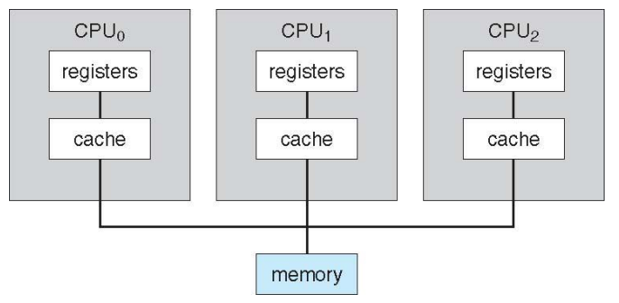
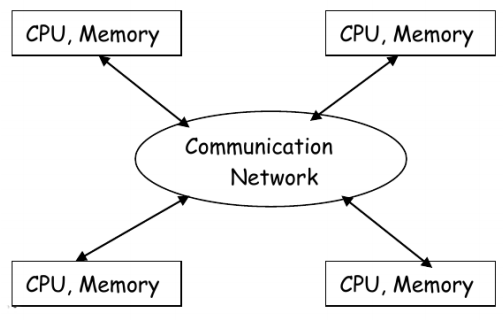

# OS_01_고등 운영체제

> 고등 운영체제, 인터럽트 기반 운영체제

## 고등 운영체제

### 기본 운영체제

- 싱글 프로세서 시스템: 하나의 메모리에 하나의 CPU가 결합된 구조 (메모리는 BUS 연결)

### 고등 운영체제

#### 다중 프로세서 **시스템** Multiprocessor system

- **병렬 시스템**: 하나의 메모리에 여러개의 CPU가 병렬로 결합된 구조
- 메인 메모리에 결합되어  있기 때문에 강한 결합(메모리 공유)
- 멀티코어와 다름 => 멀티코어는 CPU 1개, 멀티 프로세서는 CPU가 여러개 (멀티코어: 하나의 CPU에 여러개의 코어)
- 장점
  - Performance: 한번에 많은 계산을 통해 성능 향상
  - Cost: 하나의 좋은 CPU보다 여러개의 싼 CPU 사용하는 것이 저렴
  - 신뢰성: 한개의 CPU가 고장나도 다른 CPU가 작업을 대체(Robust)

#### 분산 시스템 Distributed system

- 다중 컴퓨터 시스템: 컴퓨터를 여러대 연결해 사용
- LAN으로 여러 CPU-Memory 쌍(1:1)을 연결
- 다중 프로세서 시스템과 구현 목적 같음
- 느슨한 결합(메모리 공유 안함)
- 예시
  - 일기예보에서 각 지역에 대한 분석을 각각의 컴퓨터로 진행
  - 분석 과정에서 일부 중복되는 프로세스는 공유하지만 다중 프로세서 시스템에 비해 느림
- 다중 프로세서 시스템 vs 분산 시스템
  - 다중 프로세서 시스템: 1대의 컴퓨터(슈퍼 컴퓨터), 동시에 여러가지 일을 처리
  - 분산 시스템: 여러대의 컴퓨터를 네트워크로 연결, 하나의 일을 여럿이 처리

#### 실시간 시스템 Real-time system

- Real-Time OS (RTOS) 계산이 반드시 어떤 시간내에 끝나야하는 경우
- 예시
  - 더하기, 곱하기 연산은 빠르면 좋지만 deadline이 지켜져야하는 것은 아니다
  - Navigation: 교차로 진입 전 방향을 결정해야함(deadline존재) => 실시간 시스템 사용
  - 공장 자동화, 군사 목적 등에 사용
- 참고: 리눅스는 분산시스템이고 윈도우는 다중프로세서이다? No
  - 각 OS는 어디에 속해있는 개념이 아님
  - 리눅스는 분산시스템과 다중프로세서 시스템의 목적으로 각각 사용 가능

### 인터럽트 기반 시스템

> 현대 운영체제는 인터럽트 기반 시스템

#### 운영체제

- 운영체제는 상시 메모리에 상주
- 평소에는 event를 기다리며 대기 상태
- 어떠한 명령을 지시하는 OS코드(ISR: Interrupt Service Routine)가 내재되어있음 => ex: 마우스가 ~~하면 어떤 코드를 동작
- 운영체제의 위치는 보조 기억장치(하드디스크 등) 내부

#### 인터럽트 Interrupt

- event를 발생시키는 행위
- 종류
  - 하드웨어 인터럽트: 마우스의 움직임, 클릭, 키보드 타이핑 등을 통해 발생된 전기신호
  - 소프트웨어 인터럽트: 한글파일 실행, 어셈블리어(add, sub 등)
  - 내부 인터럽트: 어떤 수를 0으로 나누지 못하므로 에러 발생시키는 것, 잘못 실행된 프로그램을 강제로 종료하는 것
- 예시(한글파일 열기)
  - 컴퓨터 전원 ON => 메인 메모리 비워져있음. CPU가 하드디스크에서 OS를 찾아 메인 메모리로 가져옴 (**부팅**)
  - 부팅 완료 후 바탕화면 출력 => OS는 대기상태
  - 마우스 움직임 => 전기신호 발생 => CPU로 보냄(**하드웨어 인터럽트**)
    - CPU는 하던 일 중지하고 OS로 점프
    - 마우스 움직이는대로 커서를 움직인다 (by ISR)
  - 더블 클릭 => 마찬가지로 interrupt 발생, (x, y) 좌표 찾아서 루틴(ISR)대로 처리
  - 한글 파일 열기 => OS가 하드디스크에서 hwp 프로그램을 메인 메모리로 올림(**소프트웨어 인터럽트**)
    - 한글 파일에 저장된 데이터도 같이 불러온다
    - 한글 파일 여는 코드는 한글 파일이 아니라 ISR로 저장되어 있는 이유 => 모든 한글 파일마다 이러한 코드를 저장해놓는 것은 메모리 낭비
  - 바탕화면에서 한글 파일로 화면 전환 => OS는 다시 event 생길 때까지 대기