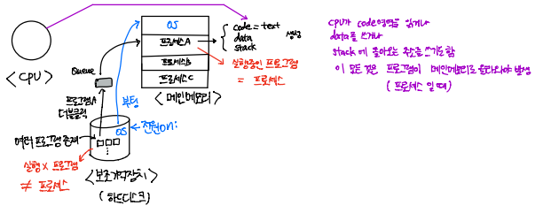
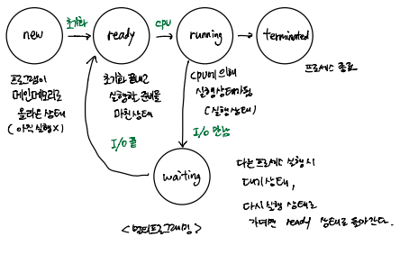
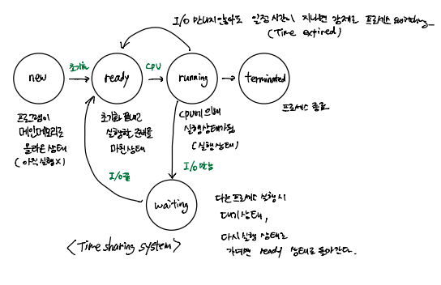
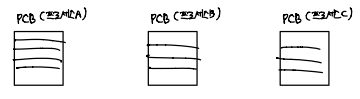
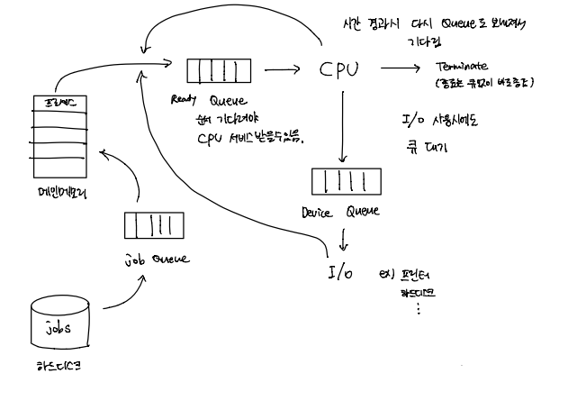
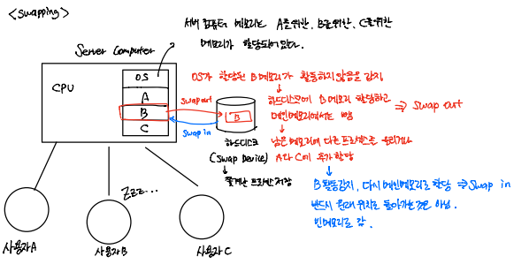

# OS_03_프로세스 관리

## 프로세스 관리 Process Management

> CPU 자원을 어떻게 효과적으로 각 프로세스에게 나누어 줄 것인지
>
> 프로세스 관리 = CPU 관리

### 프로그램 VS 프로세스

- **프로세스(process, task, job...)**: program in execution => **실행 중인 프로그램**을 프로세스라고 함 = **메모리 위에 있는 프로그램**
- 프로그램: 하드디스크 안에 있는 프로그램

- 프로그램이 하드디스크에 있을 땐 아무 일도 발생 X, 프로그램 더블 클릭 시 메인 메모리로 올라감(실행)
- 프로그램이 실행(프로세스)되면 내부적으로 pc(program counter), sp(stack pointer), register 등이 바뀐다
  - program counter: 명령어 주소 레지스터 (몇 번지를 실행할 것인지, 다음 실행할 명령어 주소 저장)
  - stack pointer: 스택 프레임의 최상단 주소를 가리키는 레지스터
  - register: 고속 메모리, 임시 저장장치
- 프로세스 구조
  - code(text): 컴파일된 소스 코드가 저장되는 영역
  - data: 전역 변수/초기화 된 데이터가 저장되는 영역
  - stack: 임시 데이터(함수 호출, 로컬 변수 등)가 저장되는 영역
  - heap: 코드에서 동적으로 생성되는 데이터가 저장되는 영역
  - 스택 프레임: 함수를 실행하기 위해 스택을 이용하여 만든 구조

- 다중 프로그래밍: CPU가 여러 프로세스를 관리 => CPU 할당하는 시간을 관리 (Time sharing system)

### 프로세스 상태

- **new**: 프로그램이 메인 메모리로 올라온 상태 (아직 실행 X)
- **ready**: 초기화 끝내고 실행할 준비를 마친 상태
- **running**: CPU에 의한 실행 상태
- **waiting**: 다른 프로세스 실행 시 대기 상태, 다시 실행 상태로 돌아갈 때 ready 상태로 돌아간다
- **terminated**: 프로세스 종료
- TSS(Time Sharing System)에서는 I/O 만나지 않아도 일정 시간이 지나면 강제로 프로세스 switching 발생(Time expired) => ready 상태로 돌아감

## PCB (Process Control Block)

> = task control Block (TCB)

- 하나의 프로세스에 대해 하나의 PCB 할당
- 프로세스에 대한 모든 정보가 들어있다
  - PID: Process ID
  - 프로세스의 상태 정보: new, ready, running 등
  - pc(process counter): 해당 프로세스가 다음에 실행할 명령어 주소
  - MMU(Mermory Management Unit) info: base, limit 정보 
    - base: 프로세스의 시작 주소
    - limit: 프로세스의 끝 주소
  - CPU Time: CPU 사용시간 => 많이 쓰면 다음 스위칭 때 적게 사용하게끔 조절하기도 한다
    - 예시) 슈퍼 컴퓨터 사용 시 CPU Time에 따라 비용을 지불한다
  - list of open files: 어떤 파일들을 사용하고 있는 지
- 이러한 정보를 담아두는 이유
  - CPU가 여러 프로세스를 왔다 갔다 스위칭하는데 다른 프로세스로 넘어가기 전 정보를 담아서 다시 돌아왔을 때 **넘어가기 직전 상태를 유지하기 위해서**
- PCB는 OS의 Process Manager에 존재

## Queue

> 하드디스크에는 많은 프로그램 존재 but 메인 메모리 공간은 한정적
>
> 처리를 위한 대기줄

### Queue 종류

- Job Queue: 하드디스크에서 메인 메모리로 올릴 때의 대기줄
- Ready Queue: 메인 메모리에서 CPU 서비스를 받기 위한 대기줄
- Device Queue: 프린터, 하드디스크와 같은 I/O Device를 사용하기 위한 대기줄

## 스케줄러 Scheduler

> 큐에는 프로세스들이 줄서서 대기하고 있음
>
> 스케줄러는 큐에서 어떤 프로세스를 먼저 처리할지 결정하는 것
>
> 반드시 큐 순서대로 처리 하는 것은 아니다
>
> OS의 Process Manager에 존재

- Job Scheduler
  - 하드디스크의 작업(job queue의 jobs) 중 어느 것을 먼저 메인 메모리로 올릴지 결정하는 프로그램
  - Long-term scheduler 
    - 메인 메모리 가득 차면 스케줄링은 발생하지 않음
    - 한 프로세스가 끝나 메모리가 비워져 자리가 생기면 스케줄링 발생 => 자주 일어 나지 않음
- **CPU Scheduler**
  - Ready Queue의 프로세스 중 어떤 것을 먼저 서비스할지 결정
  - Short-term scheduler
    - 프로세스 간 스위칭이 빠르게 돌아야 동시에 실행하는 것처럼 보임
    - 1초에 수십번 이상 발생
- Device Scheduler
  - Device 큐 중에 어떤 프로세스를 먼저 서비스할지 결정

## 멀티 프로그래밍 Multiprogramming

> 메인 메모리에 여러 프로세스를 올리는 것

- Degree of Multiprogramming: 메인 메모리에 프로세스 몇 개 올라가 있는지 정도

- 프로세스 종류

  - I/O-bound process: 주로 I/O 관련 작업하는 프로세스 (워드, ppt 등 워드프로세스)
  - CPU-bound process: 주로 CPU 사용하는 프로세스 => 계산량 많음 (날씨예보 프로세스)

- CPU와 I/O 중 한 쪽이 놀지 않도록 job 스케줄러가 메인 메모리에 올릴 때 적절히 밸런스 맞춰서 올린다

- **Medium-term scheduler**: 메모리에 있는 프로세스 중 사용되고 있지 않은 어떤 프로세스를 swap device로 보낼 지 결정

  - 대화형 시스템(Time Sharing System)의 swapping

  - Swapping은 Long-term 스케줄링보다는 자주 Short-term 스케줄링보다는 덜 발생한다

  - Swap out: 메인 메모리에서 Swap Device로 쫓아냄

  - Swap in: Swap Device에서 메인 메모리로 복귀

  - 예시

  - 

    - 사용자 B가 휴식 중이면 B 메모리 사용 X
    - OS가 메모리에 B가 할당되어 있지만 활동하지 않음 감지
    - 하드디스크로 B 메모리 할당 후 메인 메모리에서 제거 (Swap out)
    - 남은 메모리 공간에 다른 프로세스를 올리거나 A 나 C에 추가 할당
    - B가 다시 활동하면 메인 메모리로 다시 올림 (Swap in)
    - swap in 할 때 반드시 원래 위치로 돌아가는 것은 아니다 빈 메모리에 위치

    

  

  

  ​	

  ​	