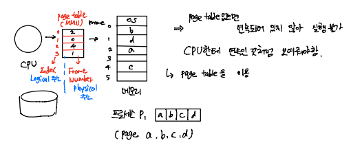
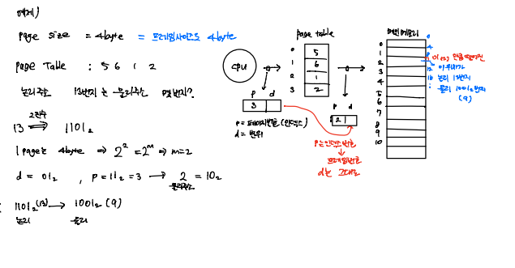
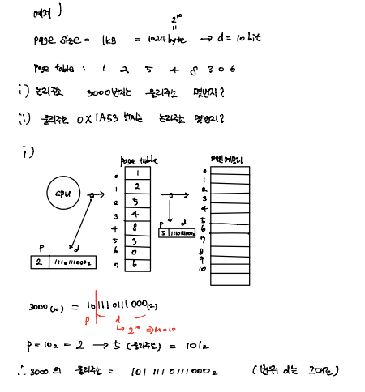
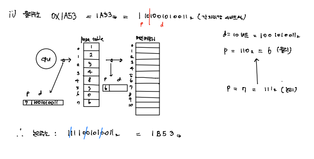
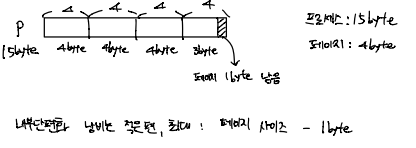
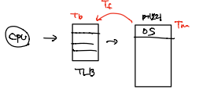

# OS_Paging

- 프로세스를 일정 크기(=페이지)로 잘라서 메모리에 할당
  - 프로세는 페이지의 집합
  - 메모리는 프레임의 집합

- 페이지를 프레임에 할당
  - MMU 내의 재배치 레지스터 값을 바꿈으로서 할당
  - CPU는 프로세스가 연속된 메모리 공간에 위치한다고 착각
  - MMU는 페이지 테이블이 된다.

## 주소 변환 Address Translation

- 논리주소
  - CPU가 내는 주소는 2진수로 표현 (전체 m 비트)
  - 하위 n비트는 오프셋(offset) 또는 변위(displacement) => 시작점에서 얼만큼 떨어져 있는지
  - 상위 m-n비트는 페이지 번호

- 주소 변환: 논리주소 -> 물리주소
  - 페이지 번호(p)는 페이지 테이블 인덱스 값
  - p에 해당되는 테이블 내용이 프레임 번호(f)
  - 변위(d)는 변하지 않음

- 예제1

- 예제2

- 예제3

## 내부 단편화, 페이지 테이블

- **내부 단편화**

  

  - 프로세스 크기가 페이지 크기의 배수가 아니라면 마지막 페이지는 한 프레임을 다 채울 수 없다
  - 남은 공간 = 메모리 낭비

- 페이지 테이블 만들기

  - **CPU 레지스터**로 => 빠르지만 큰 용량의 페이지 테이블을 넣을 순 없다
  - **메모리**로 => 큰 용량 커버 가능 하지만 느림
  - **TLB(Translation Look-aside Buffer)**로 => high speed SRAM 사용 => 두 방법의 장점 적당히 가져옴
  - 테이블 엔트리 개수 vs 변환 속도

  

## 유효 메모리 접근 시간 Effective Memory Access Time (EMAT)

- Tm: 메모리 읽는 시간
- Tb: TLB 읽는 시간
- Tf: 메모리에서 TLB로 다시 올려 읽는 시간
- EMAT = Tm + Tb => CPU가 내는 주소가 전부 TLB에 있을 경우 (hit ratio: 100%)
- 일반적으로 TLB 크기는 제한적이라 페이지 테이블 일부만 올라감, 나머지는 메모리에 존재
- h: TLB에 CPU가 낸 주소 있을 확률
- EMAT = h(Tb + Tm) + (1-h)(Tb +Tm + Tf)