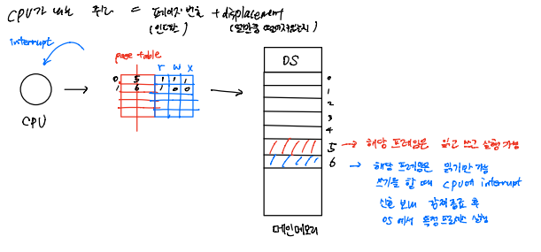
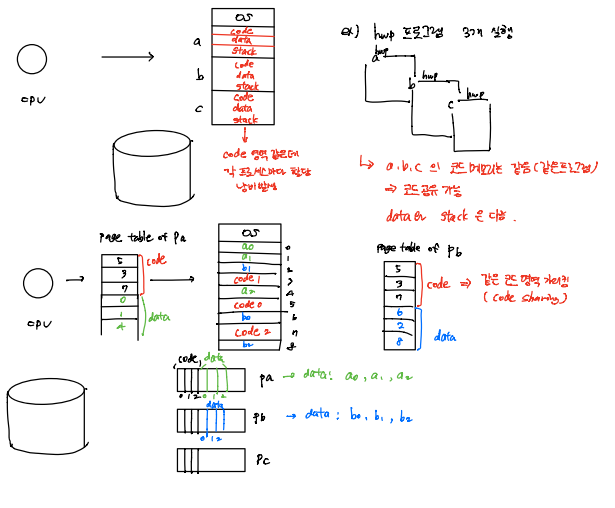
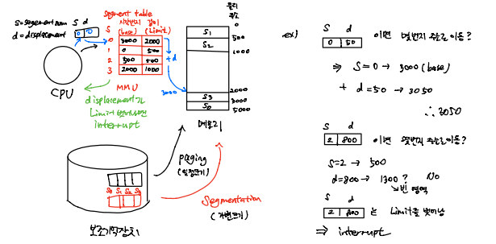
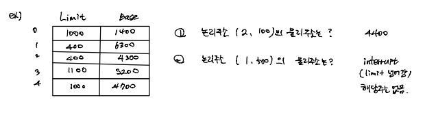
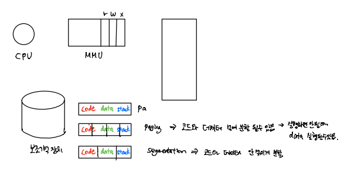

# OS_Segmentation

## Paging

### 보호와 공유

- **보호 (protection)**: 해킹 등 방지

  

  - **모든 주소는 페이지 테이블을 경유**
  - 페이지 테이블 **엔트리마다 r, w, x 비트** 둠 (read, write, execute)
  - 해당 페이지에 대한 접근 제어 가능

- **공유 (Sharing)**: 메모리 낭비 방지

  

  - 같은 프로그램을 쓰는 복수 개의 프로세스가 있다면 Code + data + stack에서 code는 공유 가능 (단, non-self-modifying code = reentrant code(재진입 코드) = pure code인 경우, 실행하면서 코드가 바뀌지 않는 코드)
  - **프로세스의 페이지 테이블 코드 영역이 같은 곳을 가리킴**

## Segmentation

- **프로세스를 논리적 내용(=세그멘트)으로 잘라서 메모리에 배치**
  - 프로세스는 세그멘트의 집합
  - 세그멘트의 크기는 일반적으로 같지 않다(페이징은 일정 크기로 분할)

- 세그멘트를 메모리에 할당
  - MMU 내의 재배치 레지스터 값을 바꿈
  - **CPU는 프로세스가 연속된 메모리 공간에 위치한다고 착각**
  - MMU는 세그멘트 테이블이 된다.

### 주소 변환 (Address Translation)

- **논리 주소 (Logical address)**
  - CPU가 내는 주소는 segment 번호(s) + 변위 (d)

- **주소 변환: 논리 주소 -> 물리 주소 (Physical address)**
  - 세그멘트 테이블 내용 = base(시작 주소) + limit(길이)
  - 세그멘트 번호는 세그멘트 테이블의 인덱스 값
  - 세그멘트 번호에 해당되는 테이블 내용으로 시작 위치 및 한계값 파악
  - 한계(limit)를 넘어서면 segment violation 예외 상황 처리 (interrupt)
  - **물리 주소 = base[s] + d**

- 예제

### 보호와 공유

- **보호(protection): 해킹 등 방지**
  - **모든 주소는 세그멘트 테이블 경유**
  - 세그멘트 테이블 **엔트리마다 r, w, x 비트** 둠 (읽기, 쓰기, 실행)
  - 해당 세크멘트에 대한 접근 제어 가능
  - **페이징보다 우월**

- **공유(sharing): 메모리 낭비 방지**
  - 같은 프로그램을 쓰는 복수 개의 프로세스가 있다면 Code + data + stack에서 code는 공유 가능 (단, non-self-modifying code = reentrant code(재진입 코드) = pure code인 경우, 실행하면서 코드가 바뀌지 않는 코드)
  - **프로세스의 세그멘트 테이블 코드 영역이 같은 곳을 가리킴**
  - **페이징보다 우월**

- 페이징보다 세그멘테이션이 우월한 이유

  - 세그멘테이션은 논리적 의미로 분할하기 때문에 영역이 섞이지 않고 분할
  - 페이징은 섞일 수 있음

  

- 하지만 대부분의 운영체제는 페이징을 사용 => 다음 챕터에서 진행

