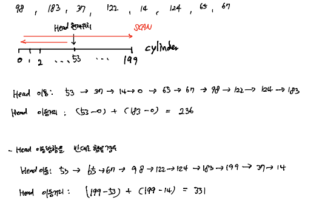
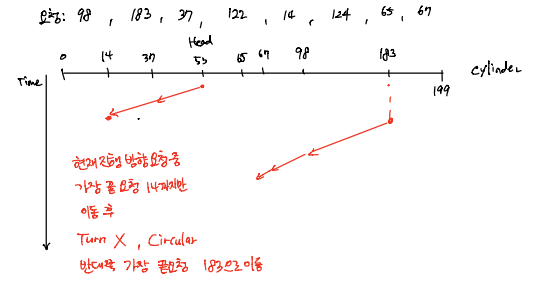

# OS_디스크 스케쥴링

## 디스크 스케쥴링

- 디스크 접근 시간

  - **Seek time** + rotational delay + transfer time
    - Seek time: 탐색 시간, 실런더에 헤드를 위치 시키는 시간
    - Rotational Delay: 헤드가 트랙 내에서 원하는 블록까지 가는 시간(회전 시간)
    - Transfer time: 블록의 섹터들과 이들 사이에 있는 갭들을 통과하는데 걸리는 시간(원하는 블록 읽는 시간?)
  - 탐색 시간(seek time)이 가장 크다

  

- 다중 프로그래밍 환경

  - 디스크 큐(Disk Queue)에는 많은 요청(request)들이 쌓여있다
  - 요청들을 어떻게 처리하면 **탐색 시간을 줄일** 수 있을까?

  

- 디스크 스케쥴링 알고리즘

  - FCFS (First Come First Served)

### FCFS Scheduling

> First Come First Serve

- **Simple** and **fair**

- 예제

  

  - 200 cylinder disk, 0 ~ 199
  - Disk Queue: 98 183 37 122 14 124 65 67
  - Head는 현재 cylinder 53에 위치
  - Total head movement = **640** cylinders
  - FCFS는 효율적? => 해당 예제에서는 효율적이지 못함

### SSTF Scheduling

> Shortest Seek Time First

- **현재 헤드 위치에서 가장 짧은 거리 움직이는 곳부터 선택**

- 예제

  

  - 200 cylinder disk, 0 ~ 199

  - Disk Queue: 98 183 37 122 14 124 65 67

  - Head는 현재 cylinder 53에 위치

  - Total head movement = **236** cylinders

- 문제점
  - Starvation 
    - 예시) 0 1 2 3 1 2 3 4 100 이 Disk Queue에 존재, 이후 Disk Queue에 50 미만으로 계속 들어오면 100은 계속 처리 안됨 (가장 짧은 거리 우선 선택)
  - SSTF는 최적 알고리즘은 아니다 (위 예제 최적 이동거리 = 208 cyl)

### SCAN Scheduling

> Scan disk

- 디스크 전체에 걸쳐서 스캔 (디스크 맨 앞(0) 또는 맨 뒤부터 쭉 스캔)

- 스캔 방향에 따라 결과 달라짐

- 예제

  

  - 200 cylinder disk, 0 ~ 199
  - Disk Queue: 98 183 37 122 14 124 65 67

  - Head는 현재 cylinder 53에 위치 (0으로 이동)

  - Total head movement = **53+183 = 236** cylinders

- 예시
  - 실린더에 요청이 고르게 분포되어있다고 가정
  - Circular SCAN 필요! (효율적)

### SCAN Variants

#### C-SCAN (Circular SCAN)

- 시작 실린더와 끝 실린더가 연결되어있는 것처럼 동작 (Circular)
- 시작 실린더에 도달했다면 시작 실린더에서 다시 시작하지 않고 끝 실린더에서 시작
- 끝 실린더에 도달했다면 끝 실린더에서 다시 시작하지 않고 시작 실린더에서 시작
- 시작 or 끝 실린더에 도달 후 반대쪽에서 시작하려고 이동할 때는 요청을 처리하면서 가는 것이 아니라서 빠르게 이동함

#### LOOK

- Head가 실린더 끝과 끝으로 이동하지 않고 가장 끝에 있는 요청까지만 이동

- 진행중인 방향으로 계속 이동할 것인지 결정하기 전에 **요청들을 보고 어디까지 갈지 결정**

- 진행중인 방향에 요청이 더 있다면 그 방향으로 계속 진행, 없으면 Turn

- 예시

  

  - 200 cylinder disk, 0 ~ 199
  - Disk Queue: 98 183 37 122 14 124 65 67

  - Head는 현재 cylinder 53에 위치

#### C-LOOK

> LOOK + C-SCAN

- 예시

  

  - 200 cylinder disk, 0 ~ 199
  - Disk Queue: 98 183 37 122 14 124 65 67
  - Head는 현재 cylinder 53에 위치

### Elevator Algorithm

> SCAN 알고리즘을 일컫는 말, 위의 디스크 이동 그림을 세워두면 엘레베이터 같음

- SCAN 알고리즘과 변종 알고리즘
  - SCAN & C-SCAN
  - LOOK & C-LOOK
- 엘레베이터처럼 현재 이동 방향으로 쭉 서비스하고 방향 전환

