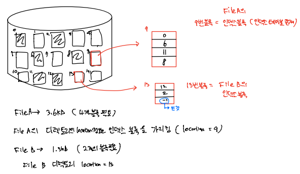

# OS_파일 할당

## 파일 할당 File Allocation

- 컴퓨터 시스템 자원 관리

  - **CPU: 프로세스 관리(CPU 스케쥴링, 프로세스 동기화)**
  - **주기억장치: 메인 메모리 관리(페이징, 가상 메모리)**
  - **보조기억장치: 파일 시스템**

  

- 보조기억장치 (하드 디스크)

  

  - 하드디스크: track (cylinder: 같은 거리의 track들의 집합), sector
  - Sector Size = 512 bytes, cf) Block Size, Block: Sector들의 집합
  - 블록 단위의 읽기/쓰기 (block device), block ↔ character
  - 디스크 = pool of free blocks

  

  - **각각의 파일에 대해 free block을 어떻게 할당할지?**

- 파일 할당
  - 연속 할당 Contiguous Allocation
  - 연결 할당 Linked Allocation
  - 색인 할당 Indexed Allocation

### 연속 할당 Contiguous Allocation

- 각 파일에 대해 디스크 상의 **연속된 블록**을 할당
- **장점: 디스크 헤더의 이동 최소화 = 빠른 I/O 성능**
- 옛날 IBM VM/CMS에서 사용
- 동영상, 음악, VOD 등에 적합 (속도가 빠르기 때문에)
- 순서대로 읽을 수도 있고 (**sequential access 순차접근**)
- 특정 부분을 바로 읽을 수도 있다 (**direct access 직접접근**)
  - Directory: 파일에 대한 정보를 모아둔 테이블 (파일이름, 크기, 생성 시간, 시작 블록 등) => OS가 유지, 전원 Off 시 하드 디스크에 저장
  - 특정 파일에 대한 정보가 적힌 디렉토리를 읽어 원하는 블록으로 접근 가능
- **단점**
  - 파일 삭제 시 생기는 공간들로 인한 **외부 단편화 발생** => **외부단편화로 인한 디스크 공간 낭비**
    - Compaction 할 수 있지만 시간 오래 걸림
  - 또한 **파일 생성 당시 이 파일의 크기를 알 수 없다** => 파일을 어느 hole에 배치??
  - **파일의 크기가 계속 증가할 수 있다** (log file) => 기존의 hole 배치로는 불가

### 연결 할당 Linked Allocation

- 파일 = Linked list of data blocks
- 파일 디렉토리(의 location)는 제일 처음 블록을 가리킨다
- 각 블록은 포인터 저장을 위한 4바이트 또는 그 이상 소모

- 새로운 파일 만들기

  - 비어있는 임의의 블록을 첫 블록으로
  - 파일이 커지면 다른 블록을 할당 받고 연결(포인터 연결) => 블록 연속할 필요 없음
  - **외부 단편화 없음**

  

- 단점

  - 순서대로 읽기만 가능(sequential access) => **Direct access 불가**
    - 디렉토리에 시작 블록 정보만 있고 몇번째 블록이 몇 번 블록인지 정보 없기 때문에 직접 접근 불가, 무조건 처음부터 읽어야함
  - **포인터 저장**을 위해 **4바이트 이상 손실**
  - **낮은 신뢰성**: 포인터 끊어지면 다음 블록들 접근 불가
  - **느린 속도**: 헤더의 움직임 많아짐

- 개선: **FAT 파일 시스템**

  

  - File Allocation Table 파일 시스템
  - MS-DOS, OS/2, Windows 등에서 사용
  - 포인터들만 모은 테이블(FAT)을 별도 블록에 저장
  - 신뢰도 문제 해결 but 느린 속도는 해결 못함
  - FAT 손실 시 복구를 위해 **이중 저장**
  - **Direct access 가능!**
    - FAT 테이블을 읽어 순서를 따라가지만 헤더를 움직여 읽는 것 아님!
  - FAT는 일반적으로 메모리 캐싱
  - FAT16:16비트 할당 => 216 ⩭ 64000 => 포인터 약 64000개

### 색인 할당 Indexed Allocation

- **파일 당 한 개의 인덱스 블록 필요** (데이터 블록 외에)
- 인덱스 블록은 **포인터의 모음**
- 디렉토리(의 location)는 인덱스 블록을 가리킨다
- Unix/Linux 등에서 사용

- 장점
  - Direct Access 가능 (FAT와 같음)
  - 외부 단편화 없음 (블록을 연속적으로 두는 것 아니기 때문에)

- 단점
  - 인덱스 블록 할당에 따른 **저장공간 손실**
    - 예시) 1바이트 파일을 위해 데이터 1블록 + 인덱스 1블록

- **파일의 최대 크기**

  - 예제1) 1블록 = 512바이트 = 4바이트 x 128개 인덱스 (한 파일 당 인덱스 개수 128개, 보통 인덱스 하나 당 4바이트)

    - 128 * 512바이트 = 64KB (파일 최대 크기)

  - 예제2) 1블록 = 1KB = 4바이트 x 256개 인덱스

    - 256 * 1KB = 256KB

  - 파일크기가 작다는 단점

  - **해결 방법**: Linked, Multilevel index, Combined 등
  
    - Linked
  
      
  
    - MultiLevel
  
    
  
    - Combined
  
    