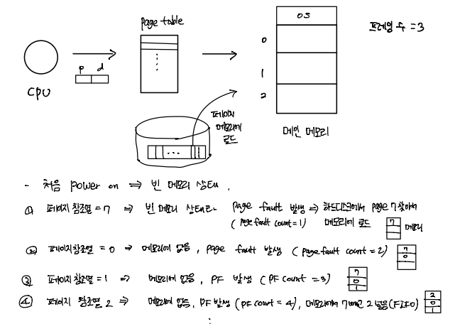
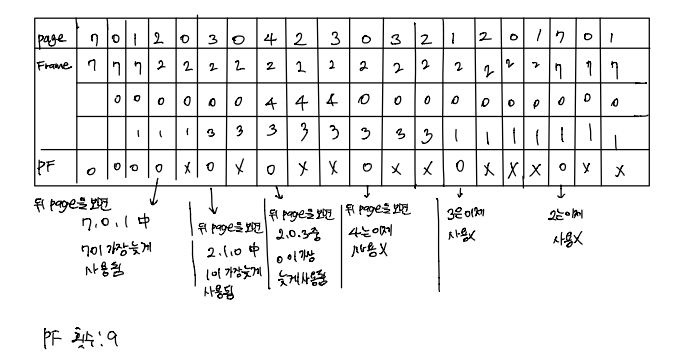
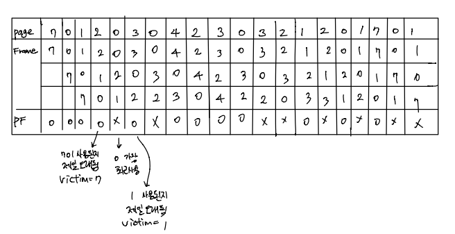
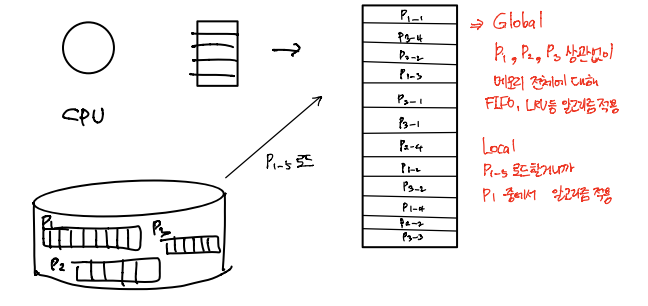

# OS_페이지 교체 알고리즘

## 페이지 교체 알고리즘

- FIFO
- OPT
- LRU
- 

### FIFO (First In First Out)

> 메모리에 먼저 로드된 페이지를 먼저 내보낸다(victim으로 선택한다)

- Simplest
  - idea: 초기화 코드는 더 이상 사용되지 않을 것

- 예제

  - 페이지 참조열 7 0 1 2 0 3 0 4 2 3 0 3 2 1 2 0 1 7 0 1
  - number of frames = 3 (메모리 프레임 3개)
  - 15 page faults

  

  

- Belady's Anomaly

  - 프레임 수 (= 메모리 용량) 증가에 PF(page fault) 회수 증가?

  

### OPT (Optimal)

- 규칙: 가장 오랫동안 쓰이지 **않을** 페이지를 victim으로 선택 => page fault가 가장 적다

- 예제

  - 페이지 참조열: 7 0 1 2 0 3 0 4 2 3 0 3 2 1 2 0 1 7 0 1
  - 프레임 수: 3
  - page fault: 9

  
  
  

- Unrealistic => 뒤에 오는 page(미래) 알수 없음
  - cf) SJF CPU 스케줄링 알고리즘 (shortest job first) => 어떤 작업이 얼마나 걸릴지 모름, 비현실적

  

### LRU (Least Recently Used)

- 규칙: 가장 오랫동안 사용되지 **않은** 페이지를 victime으로 선택
  - idea: 쵝ㄴ에 사용되지 않으면 나중에도 사용되지 않을 것
- 예제
  - 페이지 참조열: 7 0 1 2 0 3 0 4 2 3 0 3 2 1 2 0 1 7 0 1
  - 프레임 수: 3
  - page fault: 12

## Global vs Local Replacement

- Global Replacement

  - 메모리 상의 모든 프로세스 페이지에 대해 교체

  

- Local Replacement

  - 메모리 상의 자기 프로세스 페이지에 대해 교체

  

- 성능 비교

  - Global replacement가 더 효율적일 수 있다.