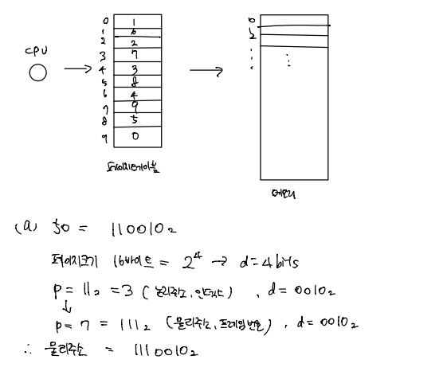

# OS_페이지 교체

## 메모리 할당 예제

### 예제 1

> 연속 메모리 할당 시스템
>
> 빈 공간 홀 100KB, 500KB, 600KB, 300KB, 200KB
>
> 212KB, 417KB, 112KB, 426KB의 크기의 프로세스를 순서대로 배치

- (a) first-fit, best-fit, worst-fit 중에서 외부 단편화 최소화 할 수 있는 것은?

- (b) 페이징 이용하는 시스템 홀 크기와 프로세스 크기 및 배치 순서는 위와 동일, 내부 단편화로 인해 낭비되어지는 메모리 크기는?

### 예제 2

> 메모리 관리 페이징 이용하는 시스템
>
> 한 페이지의 크기는 1KB
>
> 테이블 내용 순서대로 1 2 5 4 8 3 0 6

- (a) 논리주소 3000번지는 물리주소 몇번지인가?

- (b) 물리주소 1A53(16진수)는 논리주소 몇번지인가?

### 예제 3

> 메모리 관리 기법 페이징 사용 시스템
>
> 한 메모리 크기 512바이트
>
> 페이지 테이블 내용 순서대로 4 0 1 2 3 5

- (a) 논리주소 0X123 일 때 물리주소는?

- (b) 물리주소 1500 일 때 논리주소는?

### 예제 4

> 페이지 크기 16 바이트인 페이징 시스템
>
> 페이지 테이블 내용 순서대로 1 6 2 7 3 8 4 9 5 0

- (a) 논리주소 50 일 때 물리주소는?

- (b) 물리주소 10110012 일 때 논리주소는?

- (c) 30 바이트 크기 프로세스 배치하려고 한다. 내부 단편화로 인한 메모리 손실 크기는?

## 페이지 교체

### Demand Paging

- 요구되어지는 페이지만 backing store에서 가져온다
- 프로그램 실행 계속에 따라 요구 페이지가 늘어남
- 언젠가는 메모리가 가득차게 된다.

- CPU에서 주소냈는데 valid 비트가 0이면(메모리에 로드 X) Interrupt를 CPU에 보냄
- Interrupt 신호 받으면 OS에서 Interrupt 처리 루틴 수행 => 하드디스크에서 해당 페이지를 찾아 메모리에 로드
- page fault 일어난 page table의 page number를 방금 로드한 메모리 주소로 바꾸고 valid 비트를 1로 바꿈

### Memory Full

- 메모리가 가득 차면 추가로 페이지를 가져오기 위해
- 어떤 페이지는 backing store로 몰아내고 (page-out)
- 그 빈 공가능로 페이지를 가져온다 (page-in)
- 이 때 page-out된 페이지를 victim page라 한다

### Victim Page

#### 어떤 페이지를 몰아낼 것인가?

- I/O 시간 절약을 위해
- 이왕이면 modify 되지 않은 페이지를 victim으로 선택
  - 실행하면서 내용이 바뀐 페이지는 하드디스크로 돌려보낼 때 write 해줘야함 => 하드디스크에 write 하는거라 시간 오래걸림
  - 메모리에서 몰아낼 때 하드디스크에 write 안해도 됨
- 방법
  - modified bit (= **dirty bit**) => valid 비트처럼 1비트 추가 한 것 => 수정되었다면 1, 아니면 0

#### 여러 페이지 중에서 무엇을 Victim으로?

- Random

  - modified bit 1인 page 중에서 랜덤으로 victim 선택, 성능↓

- First-in-First-out(FIFO)

  - modified bit 1인 page 중에서 메모리에 먼저 로드된 page를 victim으로 선택

- 그 외, 페이지 교체 알고리즘

  - OPT(Optimal)
  - LRU(Least-Recently-Used)
  
    

#### Page reference string

- 페이지 참조 열

- 예제

  

  - CPU가 내는 주소: 100 101 102 432 612 103 104 611 612
  - 페이지 크기: 100 bytes => 최대 offset: 99
  - 페이지 번호: 1 1 1 4 6 1 1 6 6 (물리주소X, 페이지 테이블 인덱스)
  - Page reference string: 1 4 6 1 6

