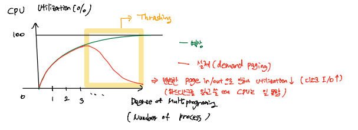
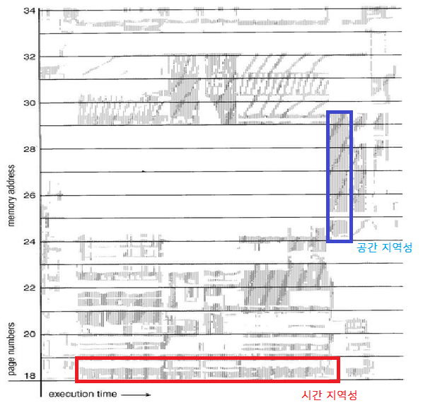
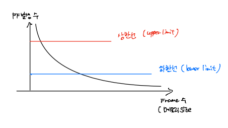

# OS_프레임할당

## Thrashing 쓰레싱

- CPU Utilization vs Degree of Multiprogramming(메인 메모리에 올라가 있는 프로세스 수)

  - 프로세스 개수 증가 => CPU 이용률 증가
  - 일정 범위를 넘어서면 CPU 이용률 감소
  - 이유: 빈번한 page in/out
  - **Thrashing**: I/O 시간 증가 때문

  

- 쓰레싱 극복

  - Global Replacement 보다는 Local Replacement
  - 프로세스 당 충분한/적절한 수의 메모리(프레임) 할당

## 프레임 할당

- Frame Allocation

  - Static

    - Equal Allocation(동일 할당): 각 프로세스에 동일한 개수 프레임 할당
    - Proportional Allocation(비례 할당): 프로세스의 크기에 비례하여 프레임 할당

    

  - Dynamic

    - Working Set Model
    - Page Fault Frequency

### 동적 프레임 할당

- Working Set Model

  - **Locality vs Working Set**

    - 지역성만큼 프레임할당? => 지역성은 실행한 후에 알 수 있다, 다음 시점의 프레임 할당은 예측 필요

    - working set은 locality를 기억하는 것 => 과거 시점에 어떤 프레임이 사용되었는지 기억하고 있다가 미래 시점에 어떤 프레임이 쓰일지 예측 (시간 지역성 이용)

  - Working Set Window

    - 어느 정도 과거까지 시간 지역성으로 볼 것인지 범위 (OS 설계에 따라 다름)

  - Working Set 크기만큼 프레임 할당

  

- Page Fault Frequency (PFF)

  

  - Page Fault 발생 비율의 상한/하한선 (OS가 count)
    - PF가 상한선보다 많이 발생하면 프레임을 더 많이 할당
    - PF가 하한선보다 적게 발생하면 프레임 할당을 줄임
  - 상한선 초과 프로세스에 더 많은 프레임 할당
  - 하한선 이하 프로세스의 프레임은 회수

## 페이지 크기

- 페이지 크기
  - 일반적 크기: 4KB → 4MB
  - 점차 커지는 경향

- 페이지 크기 영향

  - 내부 단편화 
    - 내부 단편화 측면에서 페이지 크기는 작은게 유리, 페이지 크기 작을수록 내부단편화 감소
  - Page in/out 시간 
    - page in/out 시간 측면에서는 페이지 크기 큰 것이 유리 => 페이지 교체 시간은 하드디스크 읽고 쓰는 시간이라 오래 걸림, 한번에 많이 읽고 쓰는 것이 효율적
  - 페이지 테이블 크기
    - 페이지 테이블은 SRAM => 비용적 측면으로 페이지 테이블 entry 적을수록 경제적
    - 페이지 테이블의 entry를 적게 하려면 페이지 크기는 커져야함, 페이지 크기 작으면 하나하나 entry에 다 써야함
  - Memory resolution(해상도)
    - 해상도는 높을수록 성능 좋음(정밀함)
    - 해상도가 높으려면 페이지 크기 작을수록 유리 (필요한 부분만 들고 올 수 있도록)
  - Page Fault 발생 확률
    - PF 발생을 적게하려면 페이지 크기 클수록 유리 => 교체가 적어짐

  => 척도에 따라 조절해야함

- 기술 동향
  - 페이지 테이블
    - 원래는 별도의 chip (TLB 캐시)
    - 기술 발달에 따라 캐시 메모리는 on-chip 형태로
    - TLB 역시 on-chip 내장