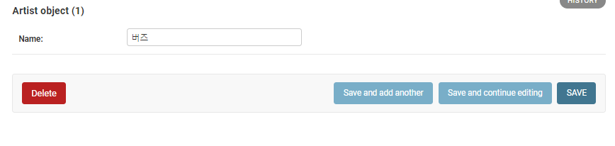
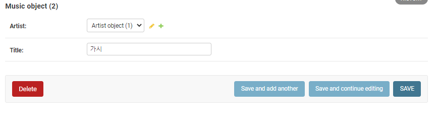
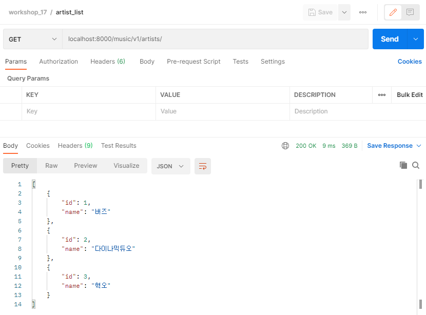
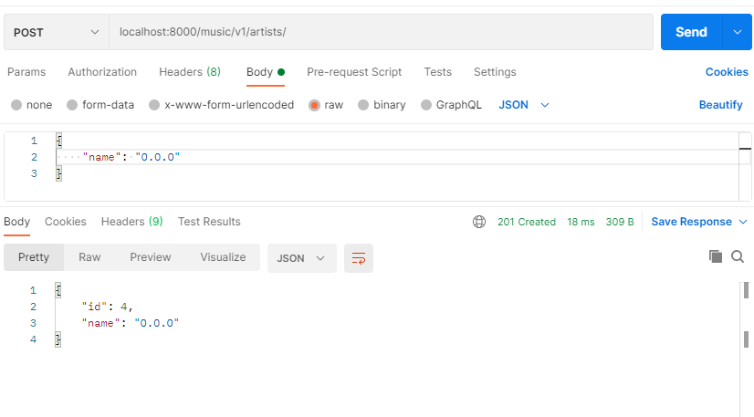
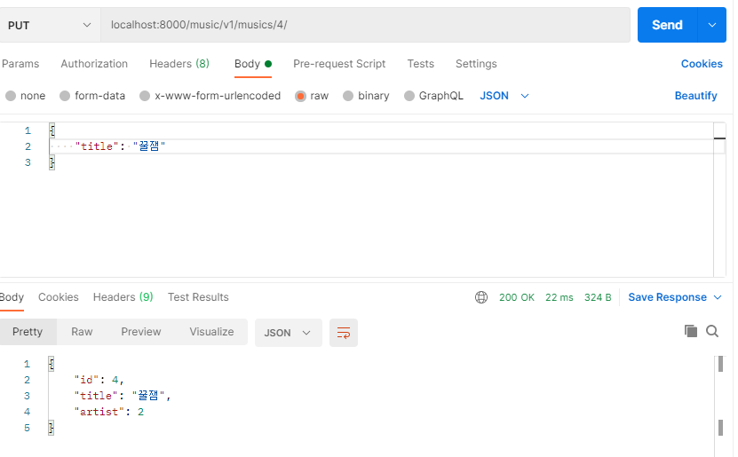
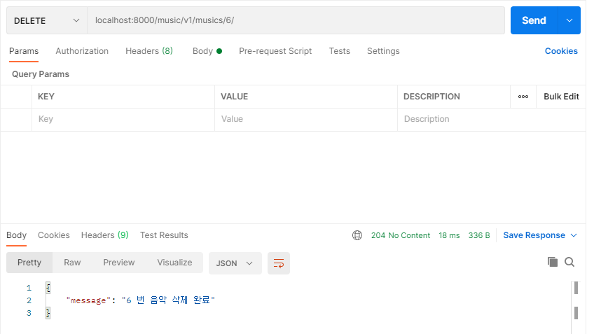

# DRF practice

> postman 사용


## 1. Model & Admin

- models.py

```python
from django.db import models

# Create your models here.
class Artist(models.Model):
    name = models.CharField(max_length=50)
    

class Music(models.Model):
    artist = models.ForeignKey(Artist, on_delete=models.CASCADE, related_name='musics')
    title = models.CharField(max_length=100)
```


- admin.py

```python
from django.contrib import admin
from .models import Artist, Music

# Register your models here.
admin.site.register(Artist)
admin.site.register(Music)
```


## 2. Serializer

- serializers.py

```python
from rest_framework import serializers
from .models import Artist, Music

class MusicListSerializer(serializers.ModelSerializer):
    class Meta:
        model = Music
        fields = '__all__'
        read_only_fields = ('artist', )


class MusicSerializer(serializers.ModelSerializer):
    title = serializers.CharField(min_length=1, max_length=100)

    class Meta:
        model = Music
        fields = '__all__'
        read_only_fields = ('artist', )


class ArtistListSerializer(serializers.ModelSerializer):
    class Meta:
        model = Artist
        fields = ('id', 'name',)


class ArtistSerializer(serializers.ModelSerializer):
    musics = MusicSerializer(many=True, read_only=True)
    music_count = serializers.IntegerField(source='musics.count')

    class Meta:
        model = Artist
        fields = ('id', 'name', 'musics', 'music_count',)
```


## 3. urls & views

- urls.py

```python
from django.urls import path
from . import views

app_name = 'music'

urlpatterns = [
    path('v1/artists/', views.artist_list_or_create),
    path('v1/artists/<int:artist_pk>/', views.artist_detail),
    path('v1/artists/<int:artist_pk>/musics/', views.create_music),
    path('v1/musics/', views.music_list),
    path('v1/musics/<int:music_pk>/', views.music_detail_or_update_or_delete),
]
```


- views.py

```python
from django.shortcuts import render, get_object_or_404
from rest_framework import status
from rest_framework.response import Response
from rest_framework.decorators import api_view
from .serializers import ArtistSerializer, ArtistListSerializer, MusicSerializer, MusicListSerializer
from .models import Artist, Music


# READ index, CREATE Artist
@api_view(['GET', 'POST'])
def artist_list_or_create(request):
    if request.method == 'GET':
        artists = Artist.objects.all()
        serializer = ArtistListSerializer(artists, many=True)
        return Response(serializer.data)

    elif request.method == 'POST':
        serializer = ArtistListSerializer(data=request.data)
        if serializer.is_valid(raise_exception=True):
            artist = serializer.save()
            return Response(serializer.data, status=status.HTTP_201_CREATED)
        return Response(serializer.errors, status=status.HTTP_400_BAD_REQUEST)


# READ detail Artist
@api_view(['GET'])
def artist_detail(request, artist_pk):
    artist = get_object_or_404(Artist, pk=artist_pk)
    serializer = ArtistSerializer(artist)
    return Response(serializer.data)


# CREATE Musics
@api_view(['POST'])
def create_music(request, artist_pk):
    artist = get_object_or_404(Artist, pk=artist_pk)
    serializer = MusicSerializer(data=request.data)
    if serializer.is_valid(raise_exception=True):
        serializer.save(artist=artist)
        return Response(serializer.data, status=status.HTTP_201_CREATED)
    return Response(serializer.errors, status=status.HTTP_400_BAD_REQUEST)


# READ index Musics
@api_view(['GET'])
def music_list(request):
    musics = Music.objects.all()
    serializer = MusicListSerializer(musics, many=True)
    return Response(serializer.data)


# READ detail, UPDATE, DELETE Music
@api_view(['GET', 'PUT', 'DELETE'])
def music_detail_or_update_or_delete(request, music_pk):
    music = get_object_or_404(Music, pk=music_pk)
    if request.method == 'GET':
        serializer = MusicSerializer(music)
        return Response(serializer.data)

    elif request.method == 'PUT':
        serializer = MusicSerializer(data=request.data, instance=music)
        if serializer.is_valid():
            serializer.save()
            return Response(serializer.data, status=status.HTTP_200_OK)
        else:
            return Response(serializer.errors, status=status.HTTP_400_BAD_REQUEST)

    elif request.method == 'DELETE':
        data = {
            'message': f'{music.pk} 번 음악 삭제 완료'
        }
        music.delete()
        return Response(data=data, status=status.HTTP_204_NO_CONTENT)
```


- admin create





- GET index artist



- POST create artist



- GET detail artist


- POST create music


- GET music index


- GET music detail


- PUT update music



- DELETE delete music

