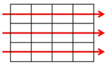
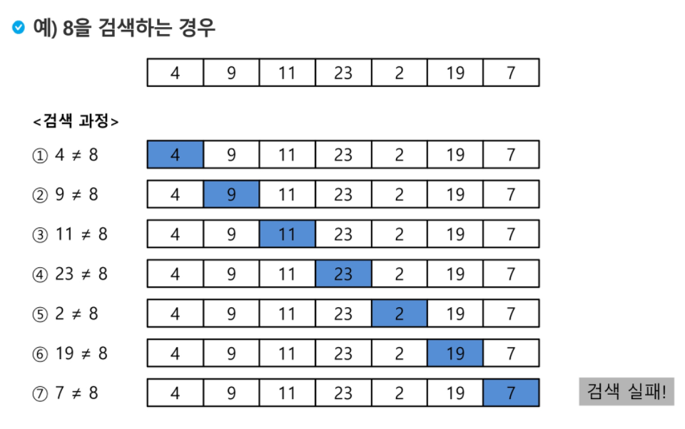

# Algorithm & List

## 입출력

### 입력

- `input()`: string 자료형으로 입력 받음
- `split()`:  default = 공백, ()기준으로 나눔
- `map()`: 자료형 변환해서 받음

```python
# 문자열 입력
S = input()

# 다수 입력
A, B = input().split()

# 정수 입력
num = int(input())

# 다수의 정수 입력
num1, num2 = map(int, input().split())

# 리스트로 받기
arr = list(map(int, input().split()))

```


### 출력

- `.format()`: fstring과 동일
- `''.join()`: str형 을 ''기준으로 합침 

```python
# fstring 대신 format
print('{} {}'.format(a, b))

# join
a = ['1', '2', '3', '4']
' '.join(a)
>>> 1 2 3 4 

a = [1, 2, 3, 4]  # join은 str만 가능 => map으로 str
' '.join(map(str, a))
```


- `print(*i)`

```python
arr = [[1, 2, 3], [4, 5, 6], [7, 8, 9]]
for i in arr:
    print(*i)
>>>
1 2 3
4 5 6
7 8 9
```


## 알고리즘

> 어떤 문제를 해결하기 위한 절차

- 표현
  - 슈더코드(의사 코드): 어떤 의도인지 보여주기 위함(문법적으로는 맞지 않음)
  - 순서도
- 좋은 알고리즘이란?
  - 정확성 => 완전탐색
  - 작업량(시간 복잡도)
  - 메모리
  - 단순성
  - 최적성

- 시간 복잡도(O)
  - 시간 복잡도 함수 중 가장 큰 영향력 주는 n에 대한 항만 표시
  - 계수 생략
  - O(logn) < O(n) < O(nlogn) < O(n^2) < O(2^n)
  - n개의 데이터 입력받아 저장 후 각 데이터에 1씩 증가 시킨 후 각 데이터를 출력하는 알고리즘의 시간복잡도는?
    - Ans: O(n)


## 배열

> 일정한 자료형의 변수들을 하나의 이름으로 열거하여 사용하는 자료구조

- 여러 개의 변수 필요할 때 효율적


### 1차원 배열

- 1차원 배열 선언

```python
arr = list()
arr = []
arr = [0] * 5  # [0, 0, 0, 0, 0]
arr = [0 for i in range(5)]
```


- 1차원 배열 접근

```python
arr[idx]  # 배열 arr의 idx번째 원소
```


### 2차원 배열

- 2차원 배열 선언

```python
# 5X5 배열
arr = [[0] * 5] * 5
arr = [[0 for i in range(5)] for j in range(5)]
```


- 2차원 배열 접근

```python
arr[row_idx][col_idx]
```


- 2차원 배열 순회

  - 행 우선 순회

  

  ```python
  arr = N X M 행렬
  for i in range(N):
      for j in range(M):
          print(arr[i][j])
  ```

  

  - 행 우선 순회 역순

  

  ```python
  arr = N X M 행렬
  for i in range(N):
      for j in range(M-1, -1, -1):
          print(arr[i][j])
  ```

  

  - 열 우선 순회

  

  ```python
  arr = N X M 행렬
  for j in range(M):
      for i in range(N):
          print(arr[i][j])
  ```

  

  - 열 우선 순회 역순

  

  ```python
  arr = N X M 행렬
  for j in range(M):
      for i in range(N-1, -1, -1):
          print(arr[i][j])
  ```

  

  - 지그재그 순회  ->, <-, ->

  

  ```python
  arr = N X M 행렬
  for j in range(N):
    for i in range(M):
          print(arr[i][j + (M - 1 - 2*j) * (i%2)])
  ```
  
  

- 델타를 이용한 2차 배열 탐색

```python
# 상하좌우 델타 접근(4방향 탐색), 시작점은 행렬의 중심
arr2 = [[1, 2, 3],
        [4, 5, 6],
        [7, 8, 9]]

r, c = 1, 1  # (r, c) => 행렬의 중심점
dr = [0, 0, -1, 1]  # dx, 좌우 이동
dc = [-1, 1, 0, 0]  # dy, 상하 이동

for i in range(4):
    nr = r + dr[i]  # next row
    nc = c + dc[i]  # next column

    print(arr2[nr][nc])  # 상하좌우 출력  2846
```


- 전치 행렬

```python
arr3 = [[1, 2, 3],
        [4, 5, 6],
        [7, 8, 9]]

for i in range(len(arr3)):
    for j in range(len(arr3[i])):
        if i < j:
            arr3[i][j], arr3[j][i] = arr3[j][i], arr3[i][j]
```


## 정렬 (추후 추가)

- key: 자료 정렬하는 기준이 되는 특정 값 ex) 카드 번호
- 종류
  - 버블 정렬
  - 카운팅 정렬
  - 선택 정렬
  - 퀵 정렬
  - 삽입 정렬
  - 병합 정렬


### 버블 정렬

> 인접한 두개의 원소를 비교하며 자리를 계속 교환

- 첫번째 원소부터 인접한 원소끼리 계속 자리를 교환하면서 맨 마지막 자리까지 교환
- 한 cycle 끝나면 가장 큰 원소가 마지막 자리로 정렬
- 시간 복잡도: O(n^2)
- 가장 쉽고 정확 but 시간 오래걸림

```python
nums = [55, 7, 78, 12, 42]

for i in range(len(nums)):
    for j in range(len(nums)-1):  # 정렬된 뒷 부분도 확인
        if nums[j] > nums[j+1]:
            nums[j], nums[j+1] = nums[j+1], nums[j]
            nums
print(nums)
>>> [7, 12, 42, 55, 78]

arr = [55, 7, 78, 12, 42]
for i in range(len(arr)-1, 0, -1):
    for j in range(i):  # 정렬된 뒷 부분은 제외
        if arr[j] > arr[j+1]:
            arr[j], arr[j+1] = arr[j+1], arr[j]

print(arr)
>>> [7, 12, 42, 55, 78]
```


### 카운팅 정렬

> 항목들의 순서를 결정하기 위해 집합에 각 항목이 몇 개씩 있는지 세는 작업 수행

- 제한 사항
  - 정수나 정수로 표현할 수 있는 자료만 적용 가능
  - 집합 내 가장 큰 정수를 알아야 한다.
- 시간 복잡도: O(n+k)
- 단점: 리스트 길이가 길거나 원소 수는 적은데 최댓값이 큰 경우 비효율적이다.
- 뒤에서 부터 정렬 => 동일한 값이 있을 때 순서 유지(안정 정렬)
- Flow
  - 각 요소 갯수를 카운트한 count 리스트 생성(각 요소의 값 = count 리스트의 인덱스)
  - count 리스트를 누적합으로 변환
  - 원본 리스트의 끝에서 부터 정렬 시작
  - 원본 리스트의 가장 마지막 인덱스의 요소값을 count 리스트의 인덱스로 하여 접근
  - 해당 count리스트 인덱스의 요소값에 -1 => -1하는 이유 인덱스 맞추기 위해
  - -1한 값을 인덱스로 하는 새로운 리스트 temp 해당 인덱스에 요소값을 원본 리스트의 요소값으로 삽입

```python
arr = [0, 4, 1, 3, 1, 2, 4, 1]
cnt = [0] * (max(arr)+1)  # 카운트 리스트

for num in arr:  # 카운트
    cnt[num] += 1

for i in range(1, len(cnt)):  # 누적합
    cnt[i] = cnt[i-1] + cnt[i]

temp = [0] * len(arr)  # 정렬된 리스트

for i in range(len(arr)-1, -1, -1):
    temp[cnt[arr[i]]-1] = arr[i]
    cnt[arr[i]] -= 1

print(temp)
>>> [0, 1, 1, 1, 2, 3, 4, 4]
```


### 선택 정렬

> k번째로 큰 또는 작은 요소를 찾는 방법. 최댓값, 최솟값, 중간값 찾는 알고리즘
>
> 바로 교환하지 않고 min_index만 갱신했다가 연산 끝난 후 교환 => 계산량 줄어듦(교환횟수가 적음)

- k번째로 작은 요소 찾기
  - 1번째부터 k번째까지 작은 요소들을 찾아 배열의 앞쪽으로 이동시키고 배열의 k번째를 반환
  - k가 비교적 작을 때 유용
  - 시간복잡도: O(kn)

```python
for i in range(k):
    min_idx = i
    for j in range(i+1, len(arr)):
        if arr[min_idx] > arr[j]:
            min_idx = j
    arr[i], arr[min_idx] = arr[min_idx], arr[i]
```


- 가장 작은 값의 요소부터 차례대로 선택하여 위치를 교환하는 정렬
  - 과정
    - 주어진 리스트 중에서 최솟값을 찾는다.
    - 그 값을 리스트의 맨 앞에 위치한 값과 교환한다
    - 맨 처음 위치를 제외한 나머지 리스트를 대상으로 위의 과정을 반복
  - 시간복잡도: O(n^2)

```python
# 바로바로 교환하지 않아 계산량이 적다
arr = [10, 15, 2, 19, 6, 14]

for i in range(len(arr)-1):  # 두번째로 큰 값까지 정렬하면 제일 큰 값은 알아서 맨 뒤에 위치
    min_idx = i
    for j in range(i+1, len(arr)):  # i+1번째부터 마지막 인덱스까지 비교
        if arr[j] < arr[min_idx]:
            min_idx = j  # 바로 교환하지 않고 인덱스 갱신만
    
    arr[i], arr[min_idx] = arr[min_idx], arr[i]  # 인덱스 갱신 끝난 후에 교환
    print('기준 idx: ', i, arr)
    
>>>
기준 idx:  0 [2, 15, 10, 19, 6, 14]
기준 idx:  1 [2, 6, 10, 19, 15, 14]
기준 idx:  2 [2, 6, 10, 19, 15, 14]
기준 idx:  3 [2, 6, 10, 14, 15, 19]
기준 idx:  4 [2, 6, 10, 14, 15, 19]
```


## 탐색

> 저장되어 있는 자료 중에서 원하는 항목을 찾는 작업
>
> 목적하는 탐색 키를 가진 항목을 찾는 것

- 탐색 키(search key): 자료를 구별하여 인식할 수 있는 키


### 완전 검색(완전 탐색)

> 문제 해법으로 생각할 수 있는 모든 경우의 수를 나열해보고 확인

- Brute-force, Generate-and-Test
- 느리지만 답은 찾을 수 있다.

- 순열 

```python
# Baby-gin => 완전 탐색, 순열 사용 => 추후 추가
# 모든 경우의 수를 구해 앞 3자리 뒤 3자리 나누어 tri인지 run인지 
nums = [2, 3, 5, 7, 7, 7]
new_nums = list(list())

for i in nums[:3]:
     for j in nums[:3]:
         if j != i:
             for k in nums[:3]:
                 if k != i and k != j:
                     new_nums.append([i, j, k])
```


### Greedy(탐욕) 알고리즘

> 최적해를 구하는데 사용되는 근시안적 방법

- 여러 경우 중 하나 결정할 때마다 그 순간에 최적이라고 생각되는 것을 선택
- 지역적으로 최적, 전체적으로는 최적X
- 떠오르는 생각을 검증없이 바로 구현

- Flow
  - 해 선택: 현 상태에서 부분 문제의 최적해를 구한 뒤 부분 해 집합에 추가
  - 실행 가능성 검사: 새로운 부분 해 집합 실행 가능한지 보고 제약 조건 체크
  - 해 검사: 새로운 부분 해 집합이 문제의 해가 되는 지 확인 아니라면 다시 해 선택으로

```python
# baby-gin
nums = [1, 2, 3, 5, 5, 5]
cnt = [0] * 10

for num in nums:
    cnt[num] += 1

run = False
tri = False

if cnt[0] >= 3:
    tri = True
    cnt[0] -= 3
elif cnt[len(cnt)-1] >= 3:
    tri = True
    cnt[len(cnt)-1] -= 3

for i in range(1, len(cnt)-1):
    # tri
    if cnt[i] >= 3:
        tri = True
        cnt[i] -= 3
    # run
    if cnt[i] == 1 and cnt[i-1] == 1 and cnt [i+1] == 1:
        run = True

if tri and run:
    print('baby-gin')
else:
    print('nope')
>>> baby-gin
```


### 순차 검색(sequential search)

> 일렬로 되어 있는 자료를 순서대로 검색하는 방법

- 가장 간단하고 직관적
- 배열이나 연결 리스트 등 순차구조로 구현된 자료구조에서 유용
- 단순하여 구현 쉽지만 검색 대상의 수가 많은 경우 수행시간 급격히 증가


#### 정렬되어 있지 않은 경우

- 검색 과정

  - 첫 번째 원소부터 순서대로 검색 대상과 키 값이 같은 원소가 있는지 비교하며 탐색
  - 키 값이 동일한 원소를 찾으면 그 원소의 인덱스 반환
  - 자료구조의 마지막에 이를 때까지 검색 대상을 찾지 못하면 검색 실패
- 첫 번째 원소 찾을 때는 1번 비교, 두번째 원소 찾을 때는 2번 비교
- 시간 복잡도: O(n)
- 정렬되지 않은 자료에서의 순차 검색의 평균 비교 횟수: (n+1)/2

<div>
      
      
</div>
  ```python
# 정렬되지 않은 경우 탐색
arr = [4, 9, 11, 23, 19, 7]

key = 2  # key = 9인 경우 1번 index에 존재

for i in range(len(arr)):
    if key == arr[i]:
        print(i, '에 위치하고 있음')
        break
else:  # 끝까지 탐색했으나 못 찾음
    print('못찾음')
  ```


#### 정렬되어 있는 경우

- 검색과정
  - 자료가 오름차순으로 정렬된 상태에서 검색한다고 가정
  - 자료를 순차적으로 검색하면서 키 값을 비교하여 요소의 키 값이 검색 대상의 키 값보다 크면 찾는 요소가 없다는 것이므로 더 이상 검색하지 않고 종료
- 정렬 되어있어 검색 실패를 반환하는 경우 평균 비교 횟수가 반으로 줄어듦
- 시간 복잡도: O(n)

<div>
      
      
</div>

```python
# 정렬되어 있는 경우
arr2 = [4, 7, 9, 11, 19, 23]
key2 = 10

for i in range(len(arr)):
    if key2 == arr2[i]:
        print(i, '에 위치하고 있음')
        break
    elif key < arr2[i]:  # 이 뒤로는 key보다 큰 값 밖에 없기때문에 더이상 탐색 의미없음음
        print(i, '번째까지만 탐색해봄')
        break

else:  # 끝까지 탐색했으나 못 찾음
    print('못찾음')
```


### 이진 탐색

> 자료의 가운데에 있는 항목의 키 값과 비교하여 다음 검색의 위치를 결정하고 검색을 진행

- **이진 검색을 하기 위해서는 자료가 정렬된 상태여야 한다**

- 검색 과정

  - 자료의 중앙에 있는 요소 고른다
  - 중앙 요소의 값과 찾고자 하는 목표 값 비교
  - 목표 값이 작을 경우 자료의 왼쪽 반에 대해 새로 검색 수행
  - 목표 값이 클 경우 자료의 오른쪽 반에 대해 새로 검색 수행
  - 찾고자 하는 값을 찾을 때 까지 위 과정을 반복

  

<div>
      
      
</div>

```python
# 이진 탐색 구현
start = 0, finish = len(arr)
while start <= finish:
    mid = (start + finish) // 2
    if arr[mid] == key:
        return true  # 검색 성공
    elif arr[mid] > key:
        finish = mid
    else:
        start = mid
return false  # 검색 실패
```


### 인덱스


## 비트연산자

- `&`: 비트 단위로 AND 연산
- `|`: 비트 단위로 OR 연산
- `<<`: 피연산자의 비트 열을 왼쪽으로 이동
- `>>`: 피연산자의 비트 열을 오른쪽으로 이동

```python
print(6 & 11)  # 0110 & 1011 => 0010 => 2
print(6 | 11)  # 0100 | 1011 => 1111 => 15
print(6 << 1)  # 0110 => 1100 => 12, A << B = A 수를 B번 왼쪽으로 shift
print(6 >> 1)  # 0110 => 0011 => 3, A >> B = A 수를 B번 오른쪽으로 shift
print(1 << 4)  # 0001 => 10000 => 16, 1 << n = 2^n

# 1 << n => 2^n, 원소가 n개일 경우 모든 부분 집합의 수 의미
# i & (i<<j): i의 j번째 비트가 1인지 아닌지
```


- 부분 집합

```python
arr = [1, 2, 3, 4]
for i in range(1 << len(arr)):  # 1 << n == 2^n
    for j in range(len(arr)+1):  # 원소의 수만큼 비트 비교
        if i & (1 << j):  # i의 j번째 비트가 1이면 j번째 원소 출력
            print(arr[j], end=', ')
    print()
print()
>>>
1, 
2, 
1, 2, 
3, 
1, 3, 
2, 3, 
1, 2, 3, 
4, 
1, 4, 
2, 4, 
1, 2, 4, 
3, 4, 
1, 3, 4, 
2, 3, 4, 
1, 2, 3, 4, 
```

