# 트리 Tree

## 트리 자료구조

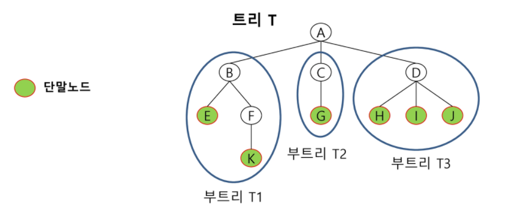

- **비선형구조**
- 원소들간 **1:N 관계를 가지는 자료구조**
- 원소들간 계층 관계를 갖는 계층형 자료구조
- 노드: 트리의 원소, 간선: 노드를 연결하는 선
- **최상위 노드 = 루트**, 말단 루트 = 리프 노드(단말 노드) => 루트: A  리프: E, K, G, H, I, J
- 루트 노드는 부모 노드가 없다, 리프 노드는 자식 노드가 없다
- 형제 노드: 같은 부모 노드의 자식 노드들 => E, K / H, I, J
- 조상 노드: 간선을 따라 루트 노드까지 이르는 경로에 있는 모든 노드들 => F의 조상 노드: A, B
- 자손 노드: 서브 트리에 있는 하위 레벨의 노드들 => B의 자손 노드: E, F, K
- 서브 트리(부트리): 부모 노드와 연결된 간선 끊었을 때 생성되는 트리
- **차수(degree)**
  - 노드의 차수: 노드에 연결된 자식 노드의 수 => B의 차수: 2, D의 차수: 3
  - 트리의 차수: 트리에 있는 차수 중 가장 큰 값 => 트리 T의 차수: 3
- **높이**
  - 노드의 높이: 루트에서 노드에 이르는 간선의 수, 노드 레벨 => B의 높이: 1, F의 높이: 2
  - 트리의 높이: 트리에 있는 노드의 높이 중에서 가장 큰 값, 최대 레벨 => T의 높이: 3
  - 일반적으로 루트를 0 레벨이라 함


## 이진 트리 Binary Tree

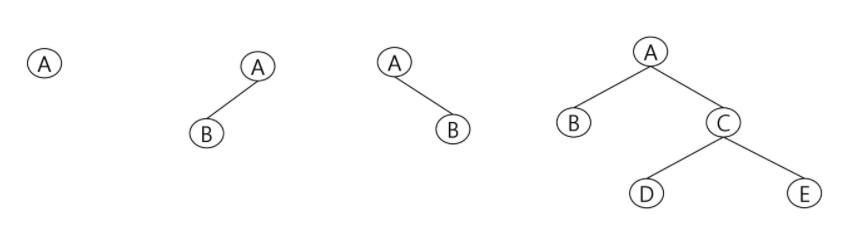

- 각 노드가 자식 노드를 **최대 2개 까지**만 갖는 트리(왼쪽 자식 노드, 오른쪽 자식 노드)
- 모든 노드들이 최대 2개의 서브 트리를 갖음
- 레벨 i에서 노드의 최대 개수: 2^i 개
- 높이가 h인 이진 트리가 가질 수 있는 노드의 최소 개수: h+1개, 최대 개수: 2^(h+1) - 1개


### 포화 이진 트리


- **모든 레벨의 노드가 포화 상태로 차 있는 이진 트리**
- 높이 h => 노드 개수: 2^(h+1) - 1개
- 루트를 1번으로 시작

- 자식 노드 번호 // 2 = 부모 노드 번호


### 완전 이진 트리


- 높이가 h이고 노드 수가 n개 일 때 (h+1 <= n <= 2^(k+1) - 1) 포**화 이진 트리의 노드 번호 1번부터 n번까지 빈자리가 없는 이진 트리**

  

- **왼쪽부터 빈자리를 채워야** 완전 이진 트리, 위의 경우에는 완전 이진 트리가 아니다.


### 편향 이진 트리

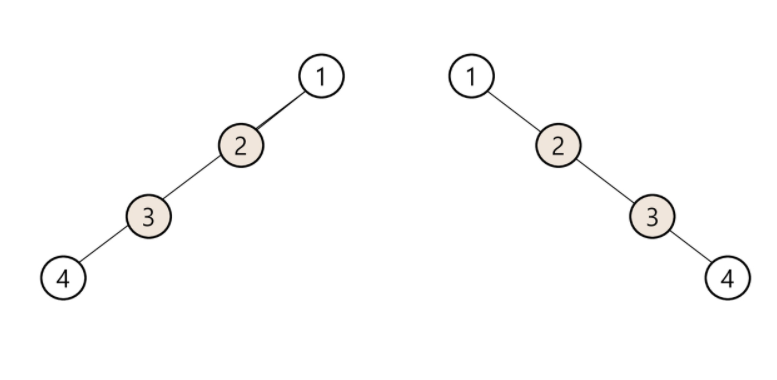

- 높이 h에 대한 최소 노드 개수를 가지며 한 쪽 방향의 자식 노드만 가진 이진 트리

- 왼쪽 편향 트리, 오른쪽 편향 트리


## 이진 트리 순회 Traversal

> 순회: 트리의 각 노드를 **중복되지 않게 전부 방문**, 비선형구조라 선후 연결 관계 알 수 없음

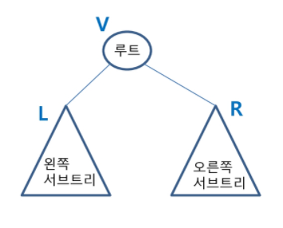

- 전위 순회(preorder), **VLR**
  - 부모 노드 방문 후, 자식 노드 좌, 우 순서로 방문
- 중위 순회(inorder), **LVR**
  - 왼쪽 자식 노드, 부모 노드, 오른쪽 자식 노드 순 방문
- 후위 순회(postorder), **LRV**
  - 자식 노드를 좌, 우 순서로 방문 후 부모 노드로 방문


### 전위 순회

- 수행방법

  1) 현재 노드 n을 방문하여 처리한다. => V

  2) 현재 노드 n의 왼쪽 서브 트리로 이동 => L

  3) 현재 노드 n의 오른쪽 서브 트리로 이동 => R

  

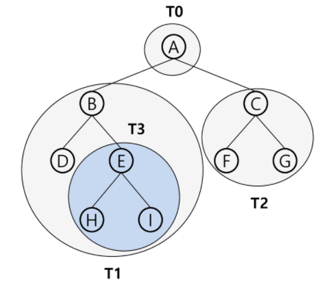

- 트리 순서: T0 -> T1, T3 -> T2
- 노드 순서: A-B-D-E-H-I-C-F-G

- 알고리즘

```python
# 전위 순회
def preorder(n):
    if n > 0:  # 0이면 연결X
        print(n, end=' ')
        preorder(left[n])
        preorder(right[n])


V, E = map(int, input().split())  # 정점, 간선
edge = list(map(int, input().split()))

left = [0] * (V + 1)  # 부모를 인덱스로 왼쪽 자식 번호 저장
right = [0] * (V + 1)  # 부모를 인덱스로 오른쪽 자식 번호 저장

par = [0] * (V + 1)  # 자식을 인덱스로 부모 번호 저장

for i in range(E):
    n1, n2 = edge[i * 2], edge[i * 2 + 1]  # n1 부모, n2 자식 노드
    if left[n1] == 0:  # 왼쪽 자식 없으면
        left[n1] = n2  # 부모를 인덱스로 자식 번호 저장
    else:  # 왼쪽 자식 있으면
        right[n1] = n2  # 부모를 인덱스로 자식 번호 저장

    par[n2] = n1  # 자식을 인덱스로 부모를 저장

root = 0
# 루트 찾기
for i in range(1, V+1):
    if par[i] == 0:  # 부모노드 없으면 루트
        root = i
        break

preorder(root)
```


### 중위 순회

- 수행방법

  1) 현재 노드 n의 왼쪽 서브 트리로 이동 => L

  2) 현재 노드 n을 방문하여 처리한다. => V

  3) 현재 노드 n의 오른쪽 서브 트리로 이동 => R


- 트리 순서: T1 -> T3 -> T0 -> T2
- 노드 순서: D-B-H-E-I-A-F-C-G

- 알고리즘

```python
def inorder(n):
    if n > 0:  # 0이면 연결X
        inorder(left[n])
        print(n, end=' ')
        inorder(right[n])
```


### 후위 순회

- 수행방법

  1) 현재 노드 n의 왼쪽 서브 트리로 이동 => L

  2) 현재 노드 n의 오른쪽 서브 트리로 이동 => R

  3) 현재 노드 n을 방문하여 처리한다. => V


- 트리 순서: T1 -> T3 -> T2 -> T0
- 노드 순서: D-H-I-E-B-F-G-C-A

- 알고리즘

```python
def postorder(n):
    if n > 0:  # 0이면 연결X
        postorder(left[n])
        postorder(right[n])
        print(n, end=' ')
```


## 이진 트리 표현

### 배열

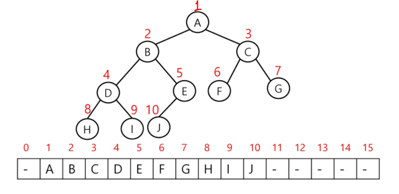

- 루트의 번호를 1로 함
- 레벨 n에 있는 노드에 대하여 왼쪽부터 오른쪽으로 2^n부터 2^(n+1)-1 번호 부여
- 노드 번호가 i인 노드의 부모 노드 번호 = floor(i/2), 버림
- 노드 번호가 i인 노드의 왼쪽 자식 노드 번호 = 2*i
- 노드 번호가 i인 노드의 오른쪽 자식의 노드 번호 = 2*i + 1
- 레벨 n의 노드 번호 시작 번호 = 2^n
- 노드 번호를 배열의 인덱스로 사용
- 배열을 이용한 이진 트리 표현의 단점
  - 편향 이진 트리의 경우에 사용하지 않는 배열 원소에 대한 메모리 공간 낭비 발생
  - 트리의 중간에 새로운 노드를 삽입하거나 기존의 노드를 삭제할 경우 배열의 크기 변경 어려움 => 비효율적


### 연결리스트 Linked List

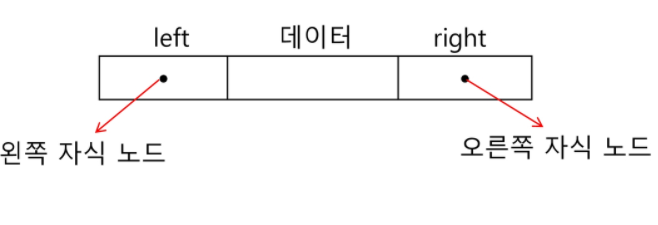

- 이진 트리의 모든 노드는 최대 2개의 자식 노드를 가지므로 일정한 구조의 단순 연결 리스트 노드를 사용하여 구현

- 완전 이진 트리 표현

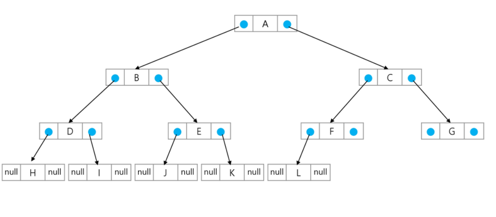

## 수식 트리

- 수식 표현 이진 트리
- 연산자는 루트 노드 or 가지 노드
- 피연산자는 모두 리프 노드

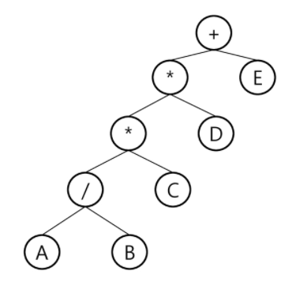

- 전위 표기법: + * * / A B C D E  (전위 순회)
- 중위 표기법: A / B * C * D + E (중위 순회)
- 후위 표기법: A B / C * D *E + (후위 순회)


## 이진 탐색 트리


- 탐색 작업을 효율적으로 하기 위한 자료구조
- 모든 원소는 서로 다른 유일한 키를 갖는다.
- 왼쪽 서브트리 key < 루트 노드 key < 오른쪽 서브 트리 key
- 왼쪽 서브트리와 오른쪽 서브트리도 이진 탐색 트리
- 중위 순회하면 오름차순으로 정렬된 값을 얻을 수 있다.


### 탐색 연산

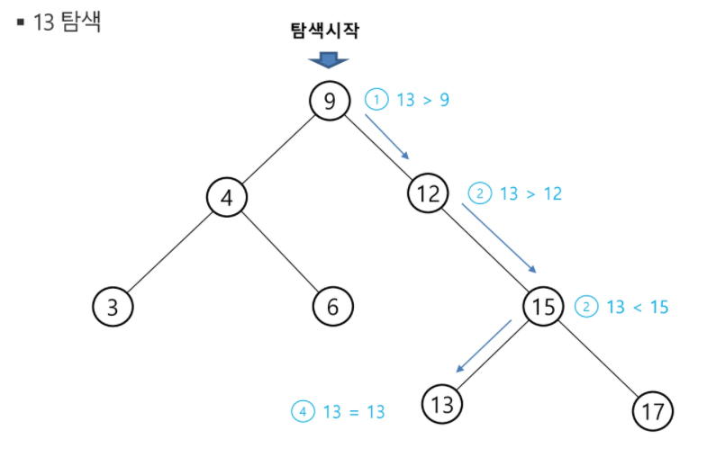

- 루트에서 시작
- 탐색할 키 값 x를 루트 노드의 키 값과 비교

  - x = 루트 노드 key: 원하는 값 찾암 => 탐색 성공

  - x < 루트 노드 key:  루트 노드의 왼쪽 서브트리에서 탐색 연산 수행

  - x > 루트 노드 key:  루트 노드의 오른쪽 서브트리에서 탐색 연산 수행
- 서브트리에 대해서 순환적으로 탐색 연산 반복


### 삽입 연산

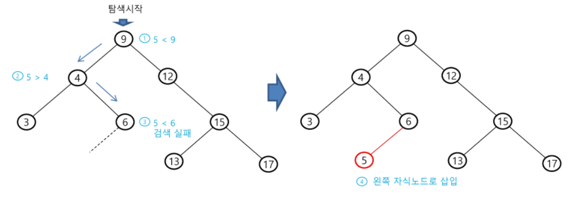

- 탐색 연산 먼저 수행
  - 삽입할 원소와 같은 원소가 트리에 있으면 삽입 X, 같은 원소가 트리에 있는지 탐색
  - 탐색에서 탐색 실패가 결정되는 위치가 삽입할 위치
- 탐색 실패한 위치에 원소를 삽입


### 삭제 연산

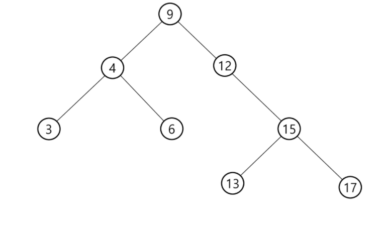

- 13, 12, 9 순서로 삭제

  1) 13 삭제 => 13은 리프 노드이므로 추가 작업 없음

  2) 12 삭제 => 12 삭제 후 9와 15 연결하는 추가 작업 필요

  3) 9 삭제 => 9는 자식이 2개, 9를 대체할 노드를 찾고 지워야함

  ​					 4는 자식이 2개 있으므로 불가, 15의 경우 13을 지워 왼쪽 자식이 없어 4와 충돌 하지 않음

  ​					 9를 15로 대체 후 9 삭제


## 힙 Heap

> **완전 이진 트리**에 있는 노드 중에서 키 값이 가장 큰 노드나 키 값이 가장 작은 노드를 찾기 위해서 만든 자료구조 (중요!)
>
> 힙의 키를 우선 순위로 활용하여 우선 순위 큐 구현 가능

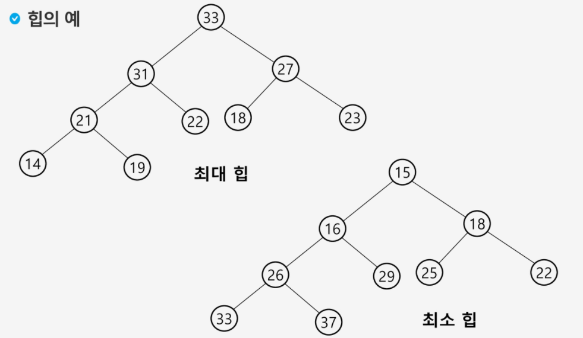

### 최대 힙 Max Heap

- 키 값이 가장 큰 노드를 찾기 위한 **완전 이진 트리**
- 부모 노드의 키 값 > 자식 노드의 키 값
- 루트 노드 : 키 값이 가장 큰 노드


### 최소 힙 Min Heap

- 키 값이 가장 작은 노드를 찾기 위한 **완전 이진 트리**
- 부모 노드의 키 값 < 자식 노드의 키 값
- 루트 노드: 키 값이 가장 작은 노드


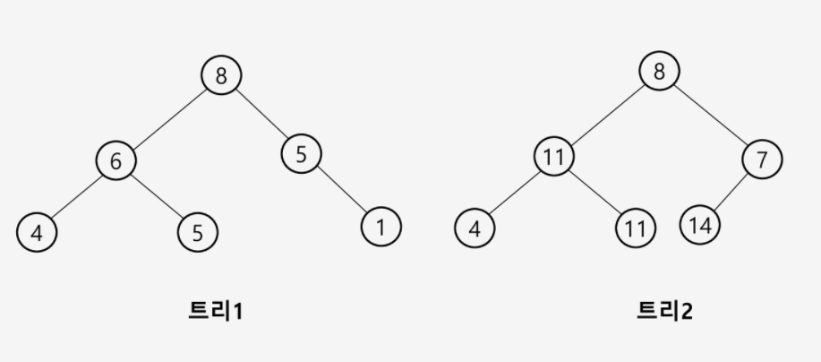

- 힙이 아닌 이유
  - 트리1: 완전 이진 트리가 아님
  - 트리2: 최대 힙인지 최소 힙인지 구분 불가(순서를 지키지 않음)


### 힙 연산

#### 삽입

- 리프 노드 삽입 => 위치 바꿀 필요없이 삽입

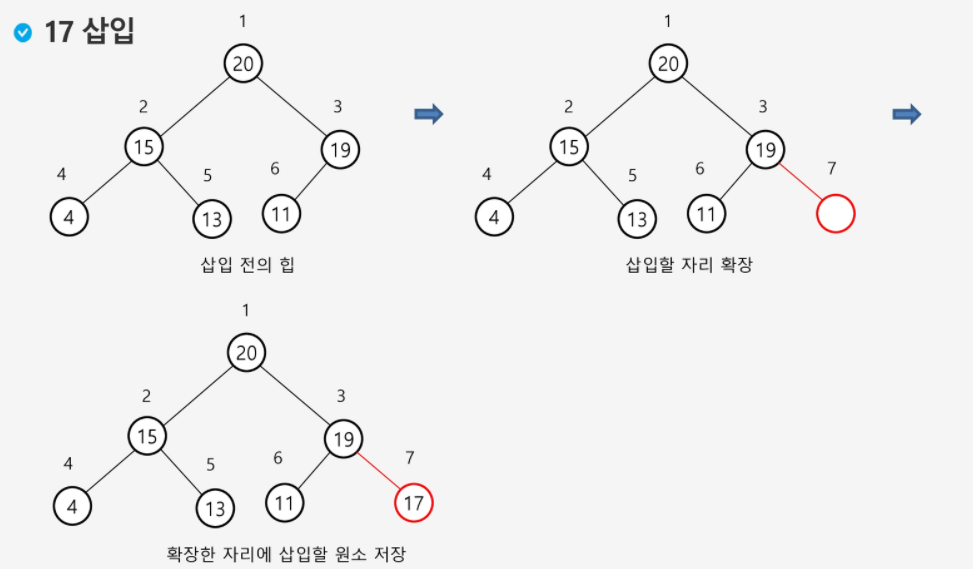


- 루트 또는 가지 노드 삽입 => 리프노드에 삽입 후 위치 바꿈

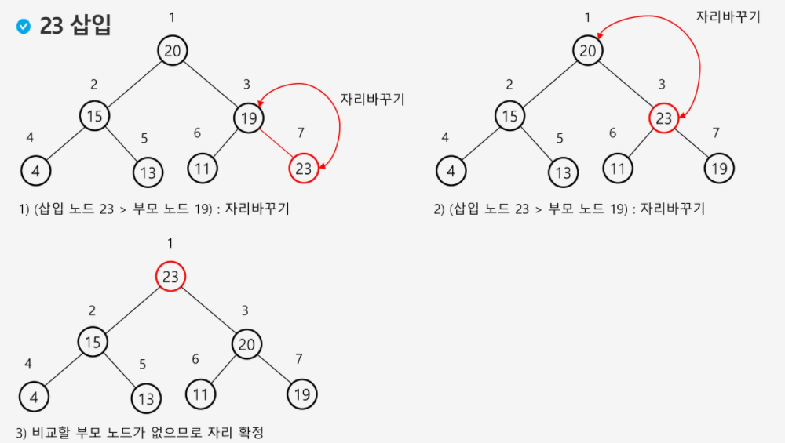


#### 삭제

- 힙에서는 루트 노드만 삭제 가능

- 루트 노드의 원소를 삭제하여 반환

- 힙 종류에 따라 최대값 또는 최소값을 구할 수 있다.

- 순서

  1) 루트 노드 값 삭제

  2) 마지막 노드 값을 루트 노드로 옮김

  3) 루트 노드와 자식 노드 비교하여 위치 바꾸기

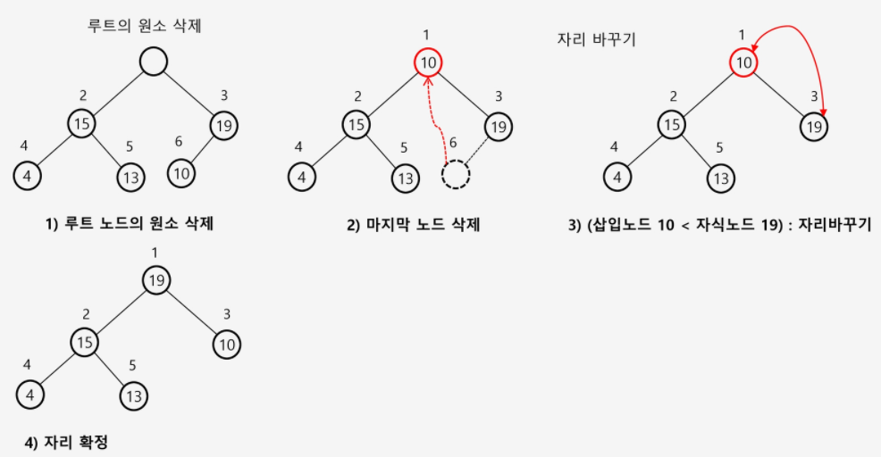

