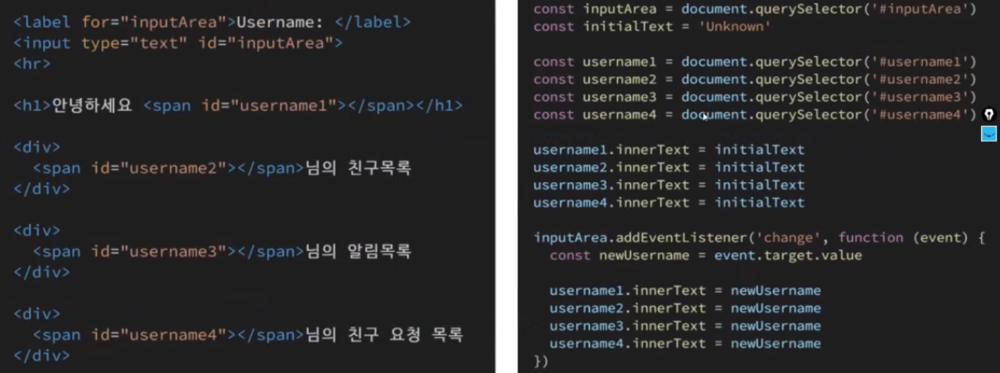
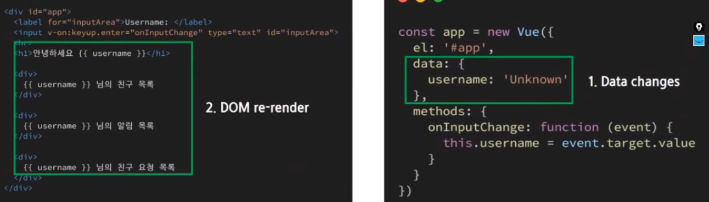

# 00_Vue Intro

## Vue Intro

### Front End Development

- 프론트 엔드 개발은 HTML, CSS, JS를 활용하여 데이터를 볼 수 있게 만들어 줌
  - 이 작업을 통해 사용자는 데이터를 눈으로 볼 수 있고 데이터와 상호 작용할 수 있음
- 프론트엔드 프레임워크: Vue.js, React, Angular


### What is Vue.js

- 사용자 인터페이스를 만들기 위한 프로그레시브 프레임워크
- 현대적인 툴과 다양한 라이브러리를 통해 **SPA(Single Page Application)**를 완벽하게 지원


### SPA

- 단일 페이지 애플리케이션 (Single Page Application)

- 현재 페이지를 동적으로 작성함으로써 사용자와 소통하는 웹 애플리케이션
- 단일 페이지로 구성되며 서버로부터 처음에만 페이지를 받아오고 이후에는 **동적으로 DOM을 구성**
  - 처음 페이지를 받은 이후에는 서버로부터 완전한 새로운 페이지를 불러오지 않고 현재 페이지를 동적으로 다시 작성
  - 연속되는 페이지 간의 **사용자 경험(UX)을 향상**
  - 모바일 사용이 증가하고 있는 현재 트래픽의 감소와 속도, 사용성, 반응성의 향상은 매우 중요한 이슈이기 때문
- 동작 원리의 일부가 **CSR(Client Side Rendering)**의 구조를 따름 (장고의 경우 SSR(Server Side Rendering))


#### SPA 등장배경

- 과거 웹 사이트들은 요청에 따라 매번 새로운 페이지를 응답하는 방식 (MAP => Multi Page Form)
- 스마트폰이 등장하면서 모바일 최적화에 대한 필요성 생김
  - 모바일 네이티브 앱과 같은 형태의 웹 페이지가 필요해짐
  - 이러한 문제를 해결하귀 위해 Vue와 같은 프론트엔드 프레임워크가 등장 => CSR, SPA의 등장
- 1개의 웹 페이지에서 여러 동작이 이루어지며 모바일 앱과 비슷한 형태의 사용자 경험 제공


### CSR

- Client Side Rendering
- 최초 요청 시 서버에서 빈 문서를 응답하고 이후 클라이언트에서 데이터를 요청해 데이터를 받아 DOM을 렌더링하는 방식
- SSR보다 초기 전송되는 페이지의 속도는 빠르지만, 서비스에서 필요한 데이터를 클라이언트(브라우저)에서 추가로 요청하여 재구성해야 하기 때문에 전체적인 페이지 완료 시점은 SSR보다 느림
- SPA가 사용하는 렌더링 방식
- 서버가 브라우저로 응답 전송 > 브라우저는 JS를 다운로드함(HTML 다운로드 아님!) > 브라우저가 리액트(또는 Vue, Angular)를 실행 > 페이지 출력, 상호작용
- 장점
  - 서버와 클라이언트 간의 트래픽 감소 => 웹 애플리케이션에 필요한 모든 정적 리소스를 최초에 한번 다운로드
  - 사용자 경험 향상 => 전체 페이지를 다시 렌더링하지 않고 변경되는 부분만을 갱신
- 단점
  - SEO(검색 엔진 최적화) 문제 발생할 수 있음


### SSR

- Server Side Rendering
- 서버에서 사용자에게 보여줄 페이지르 모두 구성하여 사용자에게 페이지를 보여주는 방식
- 서버를 이용해서 페이지를 구성하기 때문에 클라이언트에서 구성하는 CSR보다 페이지를 구성하는 속도는 늦지만 사용자에게 보여주는 콘텐츠 구성이 완료되는 시점은 빨라짐
- 서버에서 렌더링될 HTML을 브라우저로 전송 > 브라우저가 페이지를 렌더링(페이지 출력), 브라우저 JS 다운로드 > 브라우저 리액트 실행 > 페이지 상호작용

- 장점
  - 초기 로딩 속도가 빠르기 때문에 사용자가 컨텐츠를 빨리 볼 수 있음
  - SEO(검색엔진 최적화)가 가능
- 단점
  - 모든 요청에 새로고침이 되기 때문에 사용자 경험 떨어짐
  - 상대적으로 요청 횟수가 많아져 서버 부담 커짐


### SEO

- Search Engine Optimization 검색 엔진 최적화
- Vue.js 또는 React 등의 SPA 프레임워크는 SSR을 지원하는 SEO 대응 기술이 이미 존재 => SEO 대응이 필요한 페이지에 대해서는 선별적 SEO 대응 가능
- 또는 추가적으로 프레임워크 사용
  - Nuxt.js
    - Vue.js 응용프로그램 만들기 위한 프레임워크
    - SSR 지원
  - Next.js
    - React 응용프로그램 만들기 위한 프레임워크
    - SSR 지원


### SPA with SSR

- CSR과 SSR을 적절히 사용
  - 예시: Django에서 Axios를 활용한 좋아요/팔로우 로직의 경우 대부분은 Server에서 완성된 HTML을 제공하는 구조 (SSR)
  - 다만 특정 요소 (좋아요/팔로우)만 AJAX를 활용한 비동기 욫어으로 필요한 데이터를 클라이언트에서 서버로 직접 요청을 보내 받아오고 JS를 활용해 DOM을 조작 (CSR)


## Vue.js

- Vanilla JavaScript의 경우 데이터가 추가되면 추가되는 코드가 많음
  - **모든 요소를 선택**해서 **이벤트를 등록**하고 **값을 변경**




- React or Vue.js => 선언형(반응형)
  - DOM과 데이터 연결되어 있으면 데이터 변경 시 이에 연결된 DOM은 알아서 변경
  - 우리가 신경 써야 할 것은 오로지 **데이터에 대한 관리**




### MVVM 패턴

- 애플리케이션 로직을 UI로부터 분리하기 위해 설꼐된 디자인 패턴
- 구성요소
  - Model
  - View
  - View Model


#### View

- 유저 인터페이스 - 사용자에게 보여줄 틀, 구조
- HTML/CSS 등으로 작성


#### Model

- 보여줄 데이터를 담은 객체를 선언하고 저장
- 도메인 특화 데이터
- JSON


#### View Model

- Vue에서 View Model은 **모든 Vue Instance**이다
- View와 Model 사이에서 Data(M)와 DOM(V)에 관련된 모든 일을 처리
- View Model을 활용해 Data를 얼마만큼 잘 처리해서 보여줄 것인지(DOM)를 고민하는 것


### Django & Vue

- Django
  - URL -> views -> template
  - 데이터의 흐름


- Vue.js
  - 데이터가 변화하면 DOM이 변경됨
  - 데이터 로직 작성(VM)
  - DOM 작성


```html
<!DOCTYPE html>
<html lang="en">
<head>
  <meta charset="UTF-8">
  <meta http-equiv="X-UA-Compatible" content="IE=edge">
  <meta name="viewport" content="width=device-width, initial-scale=1.0">
  <title>Document</title>
</head>
<body>
  <!-- el로 연결된 것에만 반영 -->
  {{ message }}
  <br><br>

  <!-- View -->
  <div id="app">
    {{ message }}
    {{ message }}
    <br><hr><br>
  </div>

  <script src="https://cdn.jsdelivr.net/npm/vue/dist/vue.js"></script>
  <script>
    const obj = {
      el: '#app',  // 위 div id와 연결

      // Model
      data: {
        message: '이것이 Vue',
      }
    }

    // View Model (Vue 인스턴스)
    const vm = new Vue(obj)  // 인스턴스 생성

  </script>
</body>
</html>
```


### Directives

> 'v-'로 시작하는 Directives(지시)

#### v-text

- v-text || {{ }} === innerText


#### v-html

- v-html === innerHTML => html 렌더링까지 완료됨


#### v-show

- 조건부 렌더링 중 하나, 엘리먼트는 항상 렌더링 되고 DOM에 남아있음
- v-show => css display 속성 컨트롤(단순 엘리먼트에 display CSS 속성을 토글 => hidden으로 만들어 토글)
- 실제로 렌더링은 되지만 눈에서 보이지 않는 것이기 때문에 **딱 1번만 렌더링 되는 경우** v-if에 비해 상대적으로 **렌더링 비용 높음**
- **자주 변경되는 요소**라면 한번 렌더링이 된 이후부터는 보여주는 지에 대한 여부만 판단하면 되기 때문에 **토글 비용 적음**
- v-show="false" === style="display: none;"


#### v-if

- 조건부 렌더링 중 하나, 조건에 따라 블록을 렌더링
- 디렉티브의 표현식이 true 일때만 렌더링, false일 경우 렌더링 되지 않음
- 엘리먼트 및 포함된 디렉티브는 토글하는 동안 삭제되고 다시 작성됨
- **화면에서 보이지 않을 뿐만 아니라 렌더링 자체가 되지 않기 때문에 렌더링 비용 낮음**
- **자주 변경되는 요소의 경우 다시 렌더링 해야하기 때문에 비용 증가할 수 있음**


#### v-for

- 원본 데이터를 기반으로 엘리먼트 또는 템플릿 블록을 여러번 렌더링
- item in items 구문 사용, item 위치의 변수를 각 요소에서 사용할 수 있음
  - 객체의 경우 key
- v-for 사용 시 **반드시 key 속성을 각 요소에 작성**
- **v-if와 함께 사용하는 경우 v-for는 v-if보다 우선순위 높음**
  - **단, 가능하면 v-if와 동시에 사용하지 말 것**


#### v-on

- 엘리먼트에 이벤트 리스너를 연결
- 이벤트 유형은 전달인자로 표시
- 특정 이벤트가 발생했을 때, 주어진 코드가 실행됨
- 약어(shorthand)
  - @
  - v-on:click => @click


#### v-bind

- HTML 요소의 속성에 Vue의 상태 데이터를 값으로 할당
- Object 형태로 사용하면 value가 true인 key가 class 바인딩 값으로 할당
- 약어(shorthand)
  - : (콜론)
  - v-bind:href => :href


#### v-model

- HTML form 요소의 값과 data를 양방향 바인딩
- 수식어
  - . lazy
    - input 대신 change 이벤트 이후에 동기화
  - .number
    - 문자열을 숫자로 변경
  - .trim
    - 입력에 대한 trim을 진행(양쪽 공백 삭제)


### Options/Data - 'data'

- Vue 인스턴스의 데이터 객체
- Vue 앱의 상태 데이터를 정의하는 곳
- Vue template에서  interpolation을 통해 접근 가능
- v-bind, v-on과 같은 디렉티브에서도 사용 가능
- Vue 객체 냉 다른 함수에서 this 키워드를 통해 접근 가능
- 주의
  - 화살표 함수를 'data'에서 사용하면 안됨
  - 화살표 함수가 부모 컨텍스트를 바인딩하기 때문에 this는 예상과 달리 Vue 인스턴스르 가리키지 않음


### Options/Data - 'methods'

- Vue 인스턴스에 추가할 메서드
- Vue template에서 interpolation을 통해 접근 가능
- v-on과 같은 디렉티브에서도 사용 가능
- Vue 객체 내 다른 함수에서 this 키워드를 통해 접근 가능
- 주의
  - 화살표 함수(arrow function)를 메서드를 정의하는데 사용하면 안됨
  - 화살표 함수가 부모 컨텍스트를 바인딩하기 때문에 'this'는 Vue 인스턴스가 아니며 'this.a'는 정의되지 않음


### this keyword in Vue.js

- Vue 함수 객체 내에서 vue 인스턴스를 가리킴
- 단, JS 함수에서의 this 키워드는 다른 언어와 조금 다르게 동작하는 경우 있으니 주의
- 화살표 함수를 사용하면안되는 겨우
  - data
  - method 정의