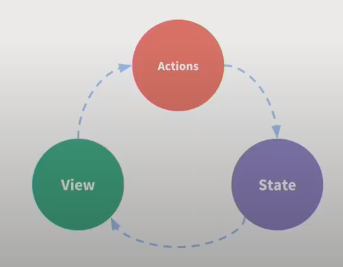
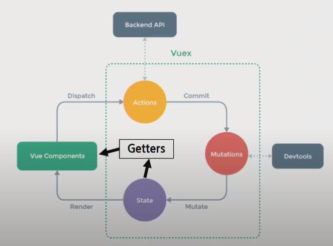

# Vuex

- 상태 관리 패턴 + 라이브러리 관리
- 상태를 전역저장소로 관리할 수 있도록 지원하는 라이브러리
  - state가 예측 가능한 방식으로만 변경될 수 있도록 보장하는 규칙 설정
  - 애플리케이션의 모든 컴포넌트에 대한 중앙 집중식 저장소 역할

## State

- 상태는 data이며, 해당 애플리케이션의 핵심이 되는 요소
- 각 컴포넌트에서 관리
  - .html의 경우 new Vue({})
  - SFC에서는 .vue에 해당
- DOM은 data(state)에 반응하여 DOM을 렌더링

## Pass props & Emit event

- 각 컴포넌트는 독립적으로 데이터를 관리
- 데이터는 단방향 흐름, 부모 => 자식 간의 전달만 가능하며 반대의 경우 이벤트를 통해 전달
- 장점: 데이터의 흐름을 직관적으로 파악 가능
- 단점: 컴포넌트 중첩이 깊어지는 경우 동위 관계의 컴포넌트로의 데이터 전달 불편(위로 올려서 내려보내야함)
- In Vuex
  - 중앙 저장소에서 state를 모아놓고 관리
  - 규모가 큰(컴포넌트 중첩이 깊은) 프로젝트에 편리
  - 각 컴포넌트에서는 중앙 집중 저장소의 state만 신경쓰면 됨
  - 이를 공유하는 컴포넌트는 알아서 동기화

## 단방향 데이터 흐름

- 상태(state)는 앱을 작동하는 원본 소스 (data)
- 뷰(view)는 상태의 선언적 매핑
- 액션(action)은 뷰에서 사용자 입력에 대해 반응적으로 상태를 바꾸는 방법(methods)
- 단점
  - 공통의 상태를 공유하는 여러 컴포넌트가 있는 경우 빠르게 복잡해짐
  - 예시: 지나치게 중첩된 컴포넌트를 통과하는 props

## 상태 관리 패턴

- 컴포넌트의 공유된 상태를 추출, 전역에서 관리
- 컴포넌트는 커다란 뷰가 되며 모든 컴포넌트는 트리에 상관없이 상태에 액세스 하거나 동작을 트리거함
- 상태 관리 및 특정 규칙 적용과 관련된 개념을 정의하고 분리 => 코드의 구조와 유지 관리 기능 향상

## Vuex 구성 요소

- State
- Actions
- Mutations
- Getters

### State

- **중앙에서 관리하는 모든 상태 정보**(**data**)
- Mutations에 정의된 메서드에 의해 변경
- 여러 컴포넌트 내부에 있는 특정 state를 중앙에서 관리
  - 이전 방식은 state를 찾기 위해 각 컴포넌트를 직접 확인
  - Vuex를 활용하는 방식은 Vuex Store에서 컴포넌트에서 사용하는 state를 한 눈에 파악 가능
- state가 변화하면 해당 state를 공유하는 컴포넌트의 DOM은 알아서 렌더링
- 컴포넌트는 Vuex Store에서 state 정보를 가져와 사용
- **dispatch()**를 사용하여 Actions 내부의 메서드를 호출

### Actions

- 컴포넌트에서 **dispatch()** 메서드에 의해 호출
- Backend API와 통신하며 **Data Fetching 등의 작업 수행**
  - **동기적인 작업 뿐만 아니라 비동기적인 작업을 포함 가능**
- 항상 **context**가 인자로 넘어옴
  - store.js 파일 내에 있는 모든 요소에 접근해서 속성 접근 & 메서드 호출이 가능
  - 단, **state를 직접 변경하지 않음**(가능은 함)
  - **mutations에 정의된 메서드를 호출해서 변경**
- state는 오로지 mutations 메서드를 통해서만 조작
  - 명확한 역할 분담을 통해 서비스 규모가 커져도 state를 올바르게 관리하기 위함

- mutations에 정의된 메서드를 **commit()** 메서드로 호출

  

### Mutations

- Actions에서 **commit()** **메서드에 의해 호출**
- **state를 변경하는 로직**
- 비동기적으로 동작하면 state가 변화하는 시점이 달라질 수 있기 때문에 **동기적인 코드만 작성**
- mutations에 정의하는 **메서드의 첫번째 인자로 state가 넘어옴**

### Getters

- state를 변경하지 않고 활용하여 계산을 수행 (**computed와 유사**)
  - 실제 계산된 값을 사용하는 것처럼 getters는 **저장소의 상태(state)를 기준으로 계산**
  - 예시: state에 todo list의 해야할 일 목록의 경우 todo가 완료된 목록만 필터링해서 보여줘야 하는 경우
  - getters에서 completed의 값이 true인 요소가 필터링해서 계산된 값을 담아 놓을 수 있음
- getters 자체가 state 자체를 변경하지 않음 (**실제 상태를 변경하지 않음**)
  - state를 특정한 조건에 따라 구분(계산)만
  - 계산된 값을 가져옴

## vscode에서 시작 시

- `vue add vuex`

- 컴포넌트에서 `dispatch`를 활용해 actions 호출
- action에 정의된 메서드는 `commit`을 활용해 mutations를 호출
- mutations에 정의된 메서드는 `state`를 조작

### mapState

- computed와 state 매핑

### mapGetters

- computed와 getters 매핑

### mapActions

- computed와 actions 매핑