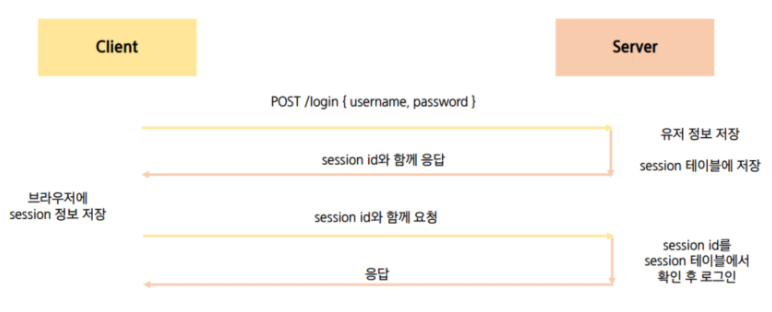
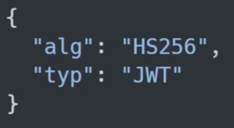
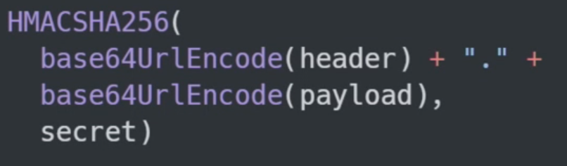
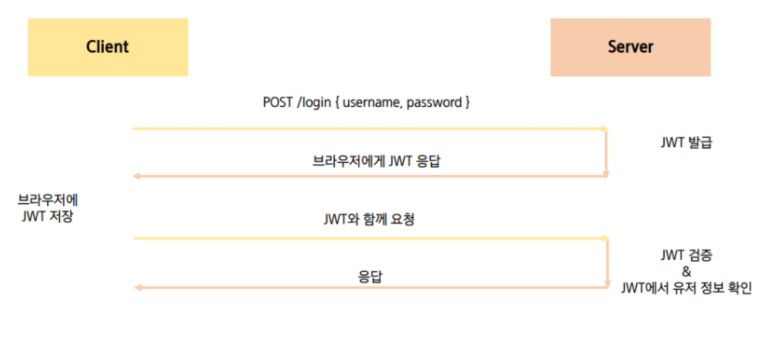

# Server & Client

## Server

- **클라이언트에게 정보, 서비스를 제공하는 컴퓨터 시스템**
- 정보 & 서비스
  - Django를 통해 응답한 template
  - DRF를 통해 응답한 JSON
- 서버는 정보 제공
  - DB와 통신하며 데이터를 CRUD
  - 요청 보낸 클라이언트에게 이러한 정보를 응답

## Client

- 네트워크를 통하여 서버라는 다른 컴퓨터 시스템 상의 원격 서비스에 접속할 수 있는 응용프로그램이나 서비스를 뜻함

- **서버에게 그 서버가 맞는(서버가 제공하는) 서비스를 요청**
- 서비스 요청을 위해 필요한 인자를 **서버가 원하는 방식에 맞게 제공**
- 서버로부터 반환되는 응답을 **사용자에게 적절한 방식으로 표현**하는 기능을 가진 시스템
- 클라이언트는 정보 요청 & 표현
  - 서버에게 정보(데이터) 요청
  - 응답 받은 정보를 가공하여 화면에 보여줌

## CORS

### Same Origin Policy (SOP)

- **동일 출처** 정책 (CORS와 반대되는 개념)
- 특정 출처(origin)에서 불러온 문서나 스크립트가 다른 출처에서 가져온 리소스와 상호작용 하는 것을 **제한하는 보안 방식**
- 잠재적으로 해로울 수 있는 문서를 분리함으로써 공격받을 수 있는 경로를 줄임
- Origin(출처) 정의
  - **두 URL의 프로토콜, 포트, 호스트**가 모두 같아야 동일한 출처라고 할 수 있음

### Cross Origin Resource Sharing (CORS)

- 교차 출처 리소스(**자원**) 공유
- **추가 HTTP  header를 사용**하여, 특정 출처에서 실행중인 웹 애플리케이션이 **다른 출처의 자원에 접근 할 수 있는 권한을 부여하도록 *브라우저*에 알려주는 체제**
- 리소스가 자신의 출처(도메인, 프로토콜, 포트)와 다를 때 교차 출처 HTTP 요청을 실행
- 보안 상의 이유로 브라우저는 교차 출처 HTTP 요청을 제한(SOP)
  - 예시: XMLHttpRequest는 SOP를 따름
- 다른 출처의 리소스를 불러오려면 그 출처에서 **올바른 CORS header를 포함한 응답을 반환**해야함
- CORS Policy
  - 교차 출처 리소스(공유) 정책
  - 다른 출처(origin)에서 온 리소스를 공유하는 것에 대한 정책
  - <=> SOP

### 교차 출처 접근 허용하기

- CORS를 사용해 교차 출처 접근 허용
- CORS는 HTTP의 일부로 어떤 호스트에서 자신의 컨텐츠를 불러갈 수 있는지 **서버에 지정할 수 있는 방법**

### Why CORS?

- 브라우저 & 웹 애플리케이션 보호

  - 악의적인 사이트의 데이터를 가져오지 않도록 차단
  - 응답으로 받는 자원에 대한 최소한의 검증
  - 서버는 정상적으로 응답하지만 브라우저에서 차단

  

- 서버의 자원 관리

  - 누가 해당 리소스에 접근 할 수 있는지 관리 가능

### How CORS?

- CORS 표준에 의해 추가된 **HTTP Header**를 통해 통제
- CORS HTTP 응답 헤더 예시
  - Access-Control-Allow-Origin 
  - Access-Control-Allow-Credentials
  - Access-Control-Allow-Headers
  - Access-Control-Allow-Methods

### Access-Control-Allow-Origin 응답 헤더

- 이 응답이 주어진 출처(origin)으로 부터 요청 코드와 공유 될 수 있는 지를 나타냄
- 예시
  - Access-Control-Allow-Origin: *
    - 브라우저 리소스에 접근하는 임의의 origin으로부터 요청을 허용한다고 알리는 응답에 포함
    - `*`는 모든 도메인에서 접근할 수 있음을 의미
    - `*`이외에 특정 origin 하나를 명시할 수 있음 => 서버에서 응답은 보내지만 브라우저에서 차단

### CORS 시나리오 예시

- Vue.js에서 A서버로 요청
- A 서버는 Access-Control-Allow-Origin에 특정한 origin을 포함시켜 응답 (CORS 응답헤더)
  - 서버는 CORS Policy와 직접적인 연관이 없고 그저 요청에 응답
- **브라우저**는 응답에 Access-Control-Allow-Origin를 확인 후 **허용 여부 결정**
- 프레임워크 별로 이를 지원하는 라이브러리 존재
  - django는 django-cors-header 라이브러리를 통해 응답 헤더 및 추가 설정 가능

## Authentication & Authorization

### Authentication

- 인증, 입증
- **자신이라고 주장하는 사용자가 누구인지 확인**하는 행위
- 모든 보안 프로세스의 첫번째 단계(가장 기본 요소)
- 내가 누구인지를 확인하는 과정
- 401 Unauthorized
  - 비로 HTTP 표준에서는 미승인(unauthorized)을 하고 있지만 의미상 이 응답은 비인증(unauthenticated)를 의미
- verifying who a user is
- Credentials(비밀번호, 얼굴인식) 검증
- Django => 게시판 서비스 로그인
- 인증 이후에 획득하는 권한 (생성, 수정, 삭제)

### Authorization

- **권한 부여**, 허가
- **사용자에게 특정 리소스(자원) 또는 기능**에 대한 **액세스 권한을 부여**하는 과정(절차)
- 보안 환경에서 권한 부여는 항상 **인증을 따라야함**
  - ex) 사용자는 조직에 대한 액세스 권한을 부여 받기 전에 먼저 자신의 ID가 진짜인지 먼저 확인해야함
- 서류 등급, 웹 페이지에서 글을 조회 & 삭제 & 수정할 수 있는 방법, 제한 구역
  - **인증 되었어도 모든 권한을 부여받는 것은 아님**
- 403 Forbidden
  - 401과 다른 점은 서버는 클라이언트가 누구인지 알고있음

- verifying what they have access to
- 규칙/규정에 의해 접근할 수 있는지 확인
- Django => 일반 유저 vs 관리자 유저
- 인증 이후에 부여되는 권한 => 로그인 후 글 작성 여부

### Authentication and authorization work together

- 회원 가입을 하고 로그인을 하면 할 수 있는 권한 생성
  - 인증 이후에 권한이 따라오는 경우가 많다
- 모든 인증을 거쳐도 권한이 동일하게 부여되는 것은 아님
  - Django에서 로그인 했더라도 다른 사람의 글까지 수정/삭제가 가능하지 않다
- **세션, 토큰, 제3자**를 활용하는 등의 다양한 인증 방식 존재

## Session / Token Based Authentication

### Session

- client가 username과 password 서버로 보냄, session에 대한 데이터는 서버에 저장(세션 테이블 필요)
- client가 보낸 데이터와 서버가 가지고 있는 데이터가 일치하면 인증 완료
- 서버가 client에게 세션 id를 발급해주고 client는 세션id를 브라우저의 쿠키에 저장 
- 이후 클라이언트는 쿠키에 발급받은 세션id를 매번 담아서 요청보냄 => 매번 인증 => HTTP는 상태가 없기 때문에(비연결성)

### Token(JWT_Json Web Token)

- Json 포맷을 활용하여 요소 간 안전하게 정보를 교환하기 위한 표준 포맷
- 암호화 알고리즘에 의한 디지털 서명이 되어 있기 때문에 자체로 검증 가능하고 신뢰할 수 있는 정보 교환 체계
- JWT 자체가 필요한 정보를 모두 갖기 때문에 (self-contained) 이를 검증하기 위한 다른 검증 수단이 필요없음 => 세션과의 차이점
- 사용처
  - Authentication, Information Exchange
- 해싱방식
- 로그인하면 서버측에서 JWT를 발급해줌
- 클라이언트는 해당 JWT과 함께 요청을 보냄

#### JWT 활용 이유

- 세션에 비해 상대적으로 HTML, HTTP 환경에서 사용하기 용이
  - 세션은 유저의 세션 정보를 서버에 보관해야함
- JWT는 Client Side에 토큰 정보를 저장하고 필요한 요청에 유효한 토큰을 같이 넣어 보내면 그 자체가 인증 수단이 됨
- 높은 보안 수준
- JSON의 범용성
- Server 메모리에 정보를 저장하지 않아 Server의 자원 절약 가능

#### JWT 구조

##### Header

- 토큰의 유형(type)과 Hashgin algorithm으로 구성

##### Payload

- 토큰에 넣을 정보
- claim은 정보의 한 조각을 의미하며 payload에는 여러 개의 claim을 넣을 수 있음
- claim의 종류
  - Registered claims
  - Public claims
  - Private claims

##### Signature

- **Header와 Payload의 encoding 값**을 더하고 거기에 **private key로 hashing** 하여 생성

#### JWT 인증 과정

- 클라이언트가 유저네임과 패스워드 전송
- 서버에서 확인하고 로그인정보를 바탕으로 비밀번호를 암호화한 토큰 발급하여 클라이언트에게 토큰 보냄(토큰 => 유저네임과 비밀번호 암호화)
- 클라이언트는 발급받은 토큰을 브라우저에 저장
- 이후 요청에서 클라이언트는 서버에 토큰을 같이 보냄
- 서버는 받은 토큰을 decoding하여 유저 정보를 추출하여 요청보낸 클라이언트를 검증함
- 단, 토큰은 서버에 저장되지 않음
-  JWT는 DB에서 유효성검사 X => self-contained 이것 자체로 인증수단이 되기 때문 => session과 차이점

### Session vs JWT

|                         |     Session      |          JWT          |
| :---------------------: | :--------------: | :-------------------: |
|  인증 수단의 저장 위치  |      Server      |        Client         |
| 인증 수단의 정보 민감성 | Low (session id) | High (self-contained) |
|        유효 기간        |        Y         |           Y           |
|         확장성          | 상대적으로 낮음  |    상대적으로 높음    |

