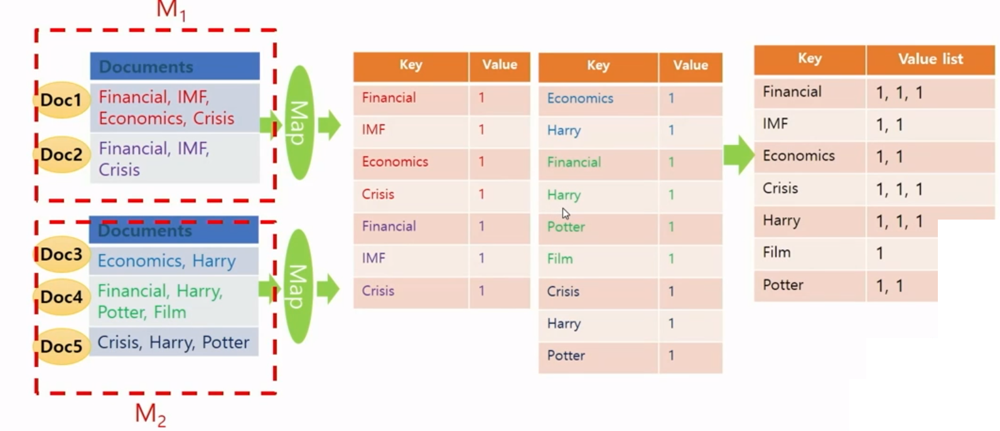
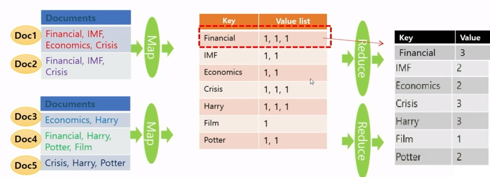

# 빅데이터 분산처리 Day1

- 개요
  - 병렬 분산 시스템과 맵리듀스 프레임워크를 이해하고 하둡을 이용하여 여러 빅데이터 분석 문제들에 대해서 맵리듀스 알고리즘을 자바 언어로 구현하고 실행


## 병렬 분산 알고리즘 사용 이유

- scale-out
  - 아주 많은 값싼 서버들을 이용
- scale-up
  - 적은 수의 값비싼 서버들을 이용
- 데이터 중심(data-intensive) 어플리케이션 분야에서는 아주 많은 값싼 서버들을 많이 이용하는 것을 선호
- 고가의 서버들은 가격에 관점에서 선형으로 성능이 증가하지 않음
  - 두 배 성능의 프로세서 1개를 가진 컴퓨터의 가격이 일반적인 프로세서 1개를 가진 컴퓨터 가격의 2배보다 훨씬 더 비쌈


## 맵리듀스 사용 이유

- 데이터 중심 프로세싱(Data-Intensive-Processing)
  - 1대의 컴퓨터의 능력으로 처리가 어려움
  - 근본적으로 수 십대, 수 백대 또는 수 천대의 컴퓨터를 묶어서 처리
  - 맵리듀스(MapReduce) 프레임워크가 하는 것이 이것
- 맵리듀스는 빅데이터를 이용한 효율적인 계산이 가능한 첫번째 프로그래밍 모델
  - 기존에 존재하는 여러 가지 다른 병렬 컴퓨팅 방법에서는 프로그래머가 낮은 레벨의 시스템 세부 내용까지 아주 잘 알고 많은 시간을 소모


## MapReduce Framework

- 빅데이터를 이용하느 응용분야에서 최근에 주목 받고 있음
- 값싼 컴퓨터들을 모아서 클러스터를 만들고 여기에서 빅데이터를 처리하기 위한 스케일러블(scalable) 병렬 소프트웨어의 구현을 쉽게 할 수 있도록 도와주는 간단한 프로그래밍 모델
  - scalable: 사용자 수가 급증하거나 데이터가 급증해도 프로그램이 멈추거나 성능이 크게 떨어지는 일 없다는 뜻
- 구글의 MapReduece 또는 오픈소스인 Hadoop은 맵리듀스 프레임워크의 우수한 구현 형태
- 드라이버에 해당하는 메인 함수가 맵(map)함수와 리듀스(reduce)함수를 호출해서 처리


### MapReduce Programming Model

- 함수형 프로그래밍 언어의 형태
- 유저는 아래 3가지 함수를 구현해서 제공해야함
  - Main 함수
  - Map 함수: (key1, val1) => [(key2, val2)]
  - Reduce 함수: (key2, [val2]) => [(key3, val3)]
- 위에 []은 리스트로 출력이 0~여러개임을 뜻한다
- Map 함수와 Reduce 함수 모두 key-value 쌍을 입/출력함
- 맵리듀스 프레임워크에서는 각각의 레코드(record) 또는 튜플(tuple)은 (key, value) 쌍으로 표현
- 맵리듀스 프레임워크는 메인 함수를 한 개의 마스터 머신(master machine)에서 수행하는데 이 머신은 맵 함수를 수행하기 전에 전처리를 하거나 리듀스 함수의 결과를 후처리 하는데 사용될 수 있다.
- 컴퓨팅 맵과 리듀스라는 유저가 정의한 함수 한 쌍으로 이루어진 맵 리듀스 페이즈(phase)를 한번 수행하거나 여러번 반복해서 수행할 수 있다.
- 한번의 맵리듀스 페이즈는 맵 함수를 먼저 호출하고 그 다음에 리듀스 함수를 호출하는데 때에 따라서는 맵 함수가 끝난 후에 컴바인(combine) 함수를 중간에 수행할 수 있다.
- 드라이버에 해당하는 메인(main) 프로그램에서 맵리듀스 페이즈를 수행시킨다.


### MapReduce Phase (3단계)

#### Map Phase

- 제일 먼저 수행되며 데이터의 여러 파티션에 병렬 분산으로 호출되어 수행된다.
- 각 머신마다 수행된  Mapper는 맵 함수가 입력 데이터의 한 줄 마다 맵 함수를 호출한다. (하나의 CPU에서는 Sequential이지만 여러대의 컴퓨터에서 실행하여 Parallel)
- Map 함수는 (key, value)쌍 형태로 결과를 출력하고 여러 머신에 나누어 보내며 같은 key를 가진 (key, value)쌍은 같은 머신으로 보내진다.


#### Shuffling Phase

- 모든 머신에서 맵 페이즈가 다 끝나면 시작된다.
- 맵 페이즈에서 각각의 머신으로 보내진 (key, value) 쌍을 key를 이용해서 정렬을 한 후에 각각의 key마다 같은 key를 가진 (key, value)쌍을 모아서 Value List를 만든 다음에 (key, value-list)형태로 key에 따라서 여러 머신에 분산해서 보낸다.


#### Reduce Phase

- 모든 머신에서 셔플링 페이즈가 다 끝나면 각 머신마다 리듀스 페이즈가 시작된다.
- distinct한 key에 대한 value-list에 대한 list function 하나가 호출됨
- 각각의 머신에서는 셔플링 페이즈에서 해당 머신으로 보내진 각각의 (key, value-list)쌍에 리듀스 함수가 호출된다.
- 출력이 있다면 (key, value)쌍 형태로 출력한다.


## Hadoop

- 아파치 프로젝트의 맵리듀스 프레임워크의 오픈 소스
- 하둡 분산 파일 시스템 (Hadoop Distributed File Sysytem-**HDFS**)
  - 빅데이터 파일을 여러대의 컴퓨터에 나누어 저장
  - 각 파일은 여러개의 순차적인 블록으로 저장
  - 하나의 파일의 각각의 블록은 폴트 톨러런스(fault tolerance)를 위해서 여러개로 복사되어 여러 머신의 여기저기 저장됨
    - fault tolerance: 시스템을 구성하는 부품의 일부에서 결함(fault) 또는 고장(failure)이 발생하여도 정상적 혹은 부분적으로 기능을 수행할 수 있는 것을 말함
- 빅데이터를 수천대의 값싼 컴퓨터에 병렬 처리하기 위해 분산

- 주요 구성 요소
  - MapReduce: 소프트웨어의 수행을 분산
  - HDFS(Hadoop Distributed File System): 데이터를 분산
- 1개의 Namenode(master)와 여러개의 Datanode(slaves)
  - Namenode
    - 파일 시스템을 관리하고 클라이언트가 file에 접근할 수 있게함
  - Datanode
    - 컴퓨터에 들어있는 데이터를 접근할 수 있게함
- 자바 프로그래밍 언어로 맵리듀스 알고리즘 구현


## MapReduce의 함수

### Map 함수

- org.apache.hadoop.mapreduce라는 패키지에 있는 Mapper 클래스를 상속받아서 맵 메소드(method)를 수정한다.
- 입력 텍스트 파일에서 라인 단위로 호출되고 입력은 (key, value-list)의 형태
- key는 입력 텍스트 파일에서 맨 앞 문자를 기준으로 맵 함수가 호출된 해당 라인의 첫번째 문자까지 offset
- value는 텍스트의 해당 라인 전체가 들어있다.


### Reduce 함수

- org.apache.hadoop.mapreduce라는 패키지에 있는 Reducer 클래스를 상속받아서 reduce 메소드를 수정한다.
- 셔플링 페이즈의 출력을 입력으로 받는데 (key, value-list)의 형태
- value-list는 맵 함수의 출력에서 key를 갖는 (key, value) 쌍들의 value들의 리스트


### Combine 함수

- 리듀스 함수와 유사한 함수인데 각 머신에서 맵 페이즈에서 맵 함수의 출력 크기를 줄여서 셔플링 페이즈와 리듀스 페이즈의 비용을 줄여주는데 사용된다.


## 맵리듀스를 이용한 WordCounting


- 머신 M1, M2에서 각각 mapper 수행
- 처음에 M1에서는 Doc1에 대한 맵함수 호출, M2에서는 Doc2에 대한 맵함수 호출됨
- 첫번째 맵함수는 맨 앞에서부터 호출되기 때문에 offset 없지만 그 뒤에 호출되는 함수들은 offset(파일 이름, 앞에 character 올 때 몇번째인지 등등) 존재 => offset은 key로 들어감
- value로 들어온 라인을 하나씩 스캔

- output


- 출력된 (key, value)쌍의 key에 따라서 해시 함수를 이용해서 여러 머신에 분산 시켜 보낸다.
  - 예시) key의 첫번째 대문자 A~G는 M1으로 나머지는 M2로 보낸다


- 셔플링 페이즈

  - key 소팅
  - 각 key마다 그 key를 가진 value들을 모아서 value-list를 만들어 (key, value-list) 형태를 출력

  

- 리듀스 페이즈 (셔플링 페이즈 output의 distinct한 (key, value-list)쌍 마다 리듀스 함수 호출)

  - value-list로 들어온 값을 더하여 value로 하고 (key, value)로 출력
  - 각각의 머신에서는 Sequential하지만 여러 머신이 동시에 수행하기 때문에 Parallel

  


### 맵리듀스 알고리즘 예제에 사용하는 설명



- 맵 함수는 value로 들어온 텍스트 라인을 스캔하면서 (key, value)형태로 출력(output)
- 맵 함수의 output을 여러 대 머신에 분산하여 보냄 but 같은 key는 같은 머신으로 보낸다 (하지만 이 예제에서는 맵함수 출력 전체를 소팅해서 value-list를 만들 것) => 실제 머신에서는 각각의 머신으로 (key, value) 쌍이 보내지고 셔플링 페이즈는 각각의 머신마다 발생 (예제에서는 한번에 모아서 처리)
- 각 key마다 그 key를 가진 value들을 모아서 value-list를 만들어 (key, value-list)형태를 출력




- Combine 함수

  - 맵 함수의 결과 크기를 줄여준다

  - 각각의 머신에서 리듀스 함수를 이용하는 것처럼 수행된다

  - 셔플링 비용을 줄여준다

  - 따라서 맵리듀스 알고리즘 디자인에서 사용하는 것이 좋다

  - 해당 예제에서는 사용X

  - Combine 예시

    

  - Combine + Shuffling (셔플링하는 소팅 데이터 수 감소 => 속도 ↑) + Reduce


### Overview of MapReduce

- **Mapper and Reducer**
  - 각 머신에서 독립적으로 수행
  - Mapper는 맵 함수를 Reducer는 리듀스 함수를 각각 수행


- **Combine functions**
  - 각 머신에서 맵 함수가 끝난 다음에 리듀스 함수가 하는 일을 부분적으로 수행
  - 셔플링 비용과 네트워크 트래픽을 감소시킴


- **Mapper와 Reducer는 필요하다면 setup() and cleanup()를 수행할 수 있다.**

  - **setup()**: 첫 맵 함수나 Reduce 함수가 호출되기 전에 맨 먼저 수행한다.

    - 모든 맵 함수들에게 Broadcast해서 전달해야 할 파라미터들 정보를 Main 함수에서 받아오는데 사용
    - 모든 맵 함수들이 공유하는 자료구조를 초기화 하는데 사용 (맵함수는 한번사용되면 없어짐)

    

  - **cleanup()**: 마지막 Map 함수나 Reduce 함수가 끝나고 나면 수행(최종적으로 수행)

    - 모든 맵 함수들이 공유하는 자료구조의 결과를 출력하는데 사용


- **한 개의 MapReduce job을 수행할 때에 Map 페이즈만 수행하고 중단할 수도 있다.**


## Hadoop 설치 및 MapReduce 알고리즘 수행

### 개발 환경 구성(Window)

#### 다운로드

- VMware 
  - https://customerconnect.vmware.com/en/downloads/details?downloadGroup=WKST-PLAYER-1612&productId=1039&rPId=66621
  - VMware workstation player 16 설치
  - Install Windows Hypervisor Platform automatically 체크 박스 클릭
- Ubuntu
  - ubuntu 20.04.2.0 LTS 다운로드 (iso 파일)
- Hadoop


#### VMware에 Ubuntu 설치

- Create a New Virtual Machine
- 다운받은 Ubuntu iso file 선택
- 계정 생성 (Full name은 아무거나, username은 hadoop, 비밀번호는 알아서)
- 나머지는 default 설정으로 설치
- Ubuntu Terminal 실행
- 패키징 파일 다운로드
  - `$ wget http://kdd.snu.ac.kr/~kddlab/Project.tar.gz`
  - `$ tar zxf Project.tar.gz`
  - `$ sudo chown –R hadoop:hadoop Project`
  - `$ cd Project`
  - `$ sudo mv hadoop-3.2.2 /usr/local/hadoop`
  - `$ sudo apt update`
  - `$ sudo apt install ssh openjdk-8-jdk ant -y`
  - `$ ./set_hadoop_env.sh`
  - `$ source ~/.bashrc`
- hadoop 계정(hadoop@ubuntu)으로 실행
  - `$ ssh-keygen -t rsa -P ""` (비밀번호 없이 실행하기 위해 "")
    - 저장 파일 어쩌구 => enter
  - `$ cat $HOME/.ssh/id_rsa.pub >> $HOME/.ssh/authorized_keys`
  - `$ ssh localhost` (생성확인)
    - yes
- /home/hadoop
  - `$ source ~/.bashrc`
  - `$ hadoop namenode -format`
  - `$ start-dfs.sh`
  - `$ start-mapred.sh(standalone 모드에서는 불필요)`
- 확인
  - `$ jps`
    - SecNameNode
    - SecondaryNameNode
    - DataNode
    - TaskTracker(standalone 모드에서는 불필요)
    - JobTracker(standalone 모드에서는 불필요)


### Linux와 HDFS

- 데이터 생성이나 코딩은 Linux에서하고 MapReduce 코드와 입력 데이터는 HDFS에 옮겨서 MapReduce 알고리즘을 수행한다
- Linux 디렉토리 (Project 폴더)
  - src/(맵리듀스 코드)
    - Driver.java (맵리듀스 코드 컴파일을 위한 코드)
    - Wordcount.java
  - template/ (과제를 위한 template)
  - datagent/ (과제 데이터를 생성하기 위한 코드)
  - data/ (과제를 위한 데이터)
  - build.xml (맵 리듀스 코드 컴파일을 위한 파일)
- Hadoop 디렉토리
  - wordcount_test/ (맵리듀스 코드 실행을 위한 데이터 디렉토리, 입력)
  - wordcount_test_out/ (맵리듀스 코드 실행 결과를 저장하는 디렉토리, 출력)

- wordcount_test 폴더를 hadoop 폴더안에 생성하고 wordcount-data.txt를 넣는다
- 이후 맵리듀스 코드를 실행하면 출력은 wordcount_test_out/ 에 저장


### wordcount MapReduce 예제 코드 실행

- Project/src/Driver.java

  - pgd.addCalss("**wordcount**", Wordcount.class, "A map/reduce program that perform word counting.");
  - src 디렉토리에 새로운 코드를 만들 때마다 src 디렉토리에 있는 Driver.java 파일에 pgd.addClass를 새로 하나 넣어 주어야함
    - pgd.addClass(**"wordcount"**, Wordcount.class, "") 에서  맨 앞의 ""안에 있는 이름으로 수행시켜야함
  - Driver.java 파일이 바뀌면 만드시 상위 디렉토리에서 ant를 다시 수행해야함(compile)
  - 실행 코드: `$ hadoop jar 패키지이름.jar **wordcount** wordcount_test `wordcount_test_out => 위에 볼드체 한 것과 이름 일치시켜야함

  

- 맵리듀스 코드 컴파일

  - `$ cd /home/hadoop/Project/`

  - `$ ant` => 이거 해줘야 jar 파일 생성됨

    - 유닉스의 make 같은 것으로 자바 개발 환경에서의 표준 빌드 도구
    - 자바 파일을 컴파일하는 Javac도 있지만 ant는 여러 dependency를 고려하여 소스파일을 컴파일
    - src 디렉토리에 있는 것을 다 모아서 컴파일 한 후에 [jarfilename].jar를 생성
    - Project 디렉토리에 있는 build.xml 파일에 정의한대로 수행

    

- 테스트 데이터를 HDFS에 넣어야함

  - `$ cd /home/hadoop/Project/`

  - `$ hdfs dfs -mkdir wordcount_test`

    - 하둡의 HDFS에 wordcount_test 디렉토리 생성

    - 경로 못찾을 경우 실행

      ```bash
      $ hdfs dfs -mkdir /user 
      $ hdfs dfs -mkdir /user/{loggedin user} 
      $ hdfs dfs -ls
      ```

      

  - $ hdfs dfs-put data/wordcount-data.txt wordcount_test

    - data 디렉토리에 있는 wordcount-data.txt 파일을 하둡의 HDFS의 wordcount_test디렉토리로 보냄

    

- **반드시 맵리듀스 프로그램이 결과를 저장할 디렉토리를 삭제한 후 프로그램을 실행해야함**

  - `$ hdfs dfs -rm -r wordcount_test_out`

  

- Hadoop 실행

  - `$ hadoop jar [jar file][program name] <input arguments ...>`
  - `$ hadoop jar 패키지이름.jar wordcount wordcount_test wordcount_test_out`


- 결과 확인 (reducer 개수를 2개 사용하면 아래와 같은 출력파일 2개가 생성됨)

  - 결과는 정렬되어있음 but 전체 정렬은 아니고 각 머신에서 정렬

  - `$ hdfs dfs -cat wordcount_test_out/part-r-00000|more`

    - 0번 reducer가 출력한 파일의 내용을 보여줌
  
    ```
    All	1
    Almighty	1
    Americans	2
    Americans:	1
    Americas.	1
    And	4
    But	5
    Divided	1
    East	1
    Finally,	2
    For	3
    I	3
    If	1
    In	2
    Let	8
    Nor	1
    North	1
    South,	1
    The	3
    To	5
    United	2
    West,	1
    a	28
    --More--
    ```

  - `$ hdfs dfs -cat wordcount_test_out/part-r-00001|more`
  
    ```
    "rejoicing	1
    "undo	1
    (and)	1
    .	3
    Administration,	1
    America	2
    Americans--born	1
    Can	1
    God	1
    God's	1
    God.	1
    Hemisphere	1
    His	2
    Isaiah--to	1
    My	1
    Nations,	1
    Now	1
    Since	1
    So	1
    This	1
    Together	1
    We	4
    Will	1
    --More--


- 새로운 맵리듀스 코드를 컴파일 하는 법
  - 소스 코드 파일을 Project/src/ 디렉토리에 넣는다
  - Project/src 디렉토리에 있는 Driver.java 파일에 아래 라인을 넣는다.
    - pgd.addCalss("program name", class name, "description");
  - 컴파일 하려면 Project 디렉토리에서 ant 수행
    - `$ ant`


- Wordcount.java 수정한 다음 실행
  - Project 디렉토리에서 ant 실행
  - 수행결과 보기
    - `$ hdfs dfs -rm -r wordcount_test_out` (리듀스 함수 출력 디렉토리 삭제 => 이미 디렉토리 있다면 삭제해야함)
    - `$ hadoop jar 패키지이름.jar wordcount wordcount_test wordcount_test_out`
    - `$ hdfs dfs -cat wordcount_test_out/part-r-00000|more`
    - `$ hdfs dfs -cat wordcount_test_out/part-r-00001|more`
  - 결과 파일들
    - part-r-00000
    - part-r-00001
    - part-r-(reducer개수 - 1)


### 맵리듀스 입출력에 사용가능한 Default 클래스

- 맵리듀스의 입출력에 사용하는 타입들은 셔플링 페이즈에서 정렬하는데 필요한 비교 함수 등 여러 함수가 이미 정의되어 있다.
  - 하둡의 맵리듀스의 맵함수, 리듀스 함수, 컴바인 함수 등에서 입출력에 사용할 수 있는 클래스와 해당되는 자바 타입
    - Text => string
    - IntWritable => int (4bytes, signed)
    - LongWritable => long (8bytes, signed)
    - FloatWritable => float (4bytes, signed)
    - DoubleWritable => double (8bytes, signed)
  - 자바 타입을 그대로 쓸 수는 없고 셔플링 페이즈에서 정렬을 해야하기 때문에 메서드가 저장되어있어야 사용 가능
- 만일 새로운 클래스를 정의해서 입출력에 사용하고 싶다면 필요한 여러 함수도 함께 정의를 같이 해줘야함


## Wordcount 코드 설명

- Wordcount.java

```java
package [name]; // 반드시 build.xml에서 사용한 이름 사용

// java 함수 include
import java.io.IOException;
import java.util.StringTokenizer;

// hadoop 함수 include
import org.apache.hadoop.conf.Configuration;
import org.apache.hadoop.fs.Path;
import org.apache.hadoop.io.IntWritable;
import org.apache.hadoop.io.Text;
import org.apache.hadoop.mapreduce.Job;
import org.apache.hadoop.mapreduce.Mapper;
import org.apache.hadoop.mapreduce.Reducer;
import org.apache.hadoop.mapreduce.lib.input.FileInputFormat;
import org.apache.hadoop.mapreduce.lib.output.FileOutputFormat;
import org.apache.hadoop.util.GenericOptionsParser;

public class Wordcount {
	/* 
	Object, Text : input key-value pair type (always same (to get a line of input file))
	Text, IntWritable : output key-value pair type
	*/
    
    // Mapper를 상속받아 TokenizerMapper 생성, Object는 상위 타입으로 모든 것을 포함
    // static class는 class A안의 class B를 자신의 상위 class A를 만들지 않고 B의 instance를 만들 수 있다.
    // <Object,Text,Text,IntWritable> => <Map 함수 입력 Key 타입, Map 함수 입력 Value, Map 함수 출력 Key 타입, Map 함수 출력 Value>
	public static class TokenizerMapper
			extends Mapper<Object,Text,Text,IntWritable> {

		// variable declairations
        // final => 값 변경 X
		private final static IntWritable one = new IntWritable(1);
		private Text word = new Text();

		// map function (Context -> fixed parameter)
		public void map(Object key, Text value, Context context)
				throws IOException, InterruptedException {

			// value.toString() : get a line(오브젝트를 스트링으로 변환)
            // StringTokenizer => 스트링을 단어 단위로 자름
            // Hadoop의 Text 타입인 value를 string 타입으로 바꾸어 줘야 StringTokenizer 함수를 호출할 수 있어 Text 타입의 toString 멤버함수 사용
			StringTokenizer itr = new StringTokenizer(value.toString());
			while ( itr.hasMoreTokens() ) {
                // Output key를 set
				word.set(itr.nextToken());

				// emit a key-value pair, key와 value는 반드시 선언한 타입이어야함
				context.write(word,one);
			}
		}
	}

	/*
	Text, IntWritable : input key type and the value type of input value list
	Text, IntWritable : output key-value pair type
	*/
    // <Text,IntWritable,Text,IntWritable> => <Reduce 함수 입력 Key 타입, Reduce 함수 입력 Value, Reduce 함수 출력 Key 타입, Reduce 함수 출력 Value>
	public static class IntSumReducer
			extends Reducer<Text,IntWritable,Text,IntWritable> {

		// variables
		private IntWritable result = new IntWritable();

		// key : a disticnt word
		// values :  Iterable type (data list) IntWritable 타입의 리스트
		public void reduce(Text key, Iterable<IntWritable> values, Context context) 
				throws IOException, InterruptedException {

			int sum = 0;
			for ( IntWritable val : values ) {
				sum += val.get();
			}
			result.set(sum);  // output value를 set
            // (key, result) 키-밸류 쌍을 emit, 키와 밸류는 반드시 선언한 타입이어야한다
			context.write(key,result);  
		}
	}


	/* Main function */
	public static void main(String[] args) throws Exception {
        // job 수행하기 위한 설정 초기화
		Configuration conf = new Configuration();
		String[] otherArgs = new GenericOptionsParser(conf,args).getRemainingArgs();
		if ( otherArgs.length != 2 ) {
			System.err.println("Usage: <in> <out>");
			System.exit(2);
		}
        // job 작성, 따옴표 안은 설명을 쓰면됨(상관없음)
		Job job = new Job(conf,"word count");
        // job을 수행할 class 선언, 파일명.class, 대소문자주의
		job.setJarByClass(Wordcount.class);

		// let hadoop know my map and reduce classes
		job.setMapperClass(TokenizerMapper.class);
        /*
        Combiner 사용시, Combiner class 선언
        job.setCombinerClass(IntSumReducer.class);
        */
		job.setReducerClass(IntSumReducer.class);
        
		// output key, value 타입 선언(Reduce의 output 타입 선언)
        /* 
        	Map과 Reduce output 같을 때는 Map output에 대한 지정 생략 가능, 다르다면 아래와 같이 선언해줘야함
        	job.setMapOutputKeyClass(Text.class);
			job.setMapOutputValueClass(IntWritable.class);
        */
		job.setOutputKeyClass(Text.class);
		job.setOutputValueClass(IntWritable.class);

		// set number of reduces, 동시에 수행되는 reducer 개수
		job.setNumReduceTasks(2);

		// set input and output directories
        // 입력 데이터가 있는 path
		FileInputFormat.addInputPath(job,new Path(otherArgs[0]));
        // 결과를 출력할 path
		FileOutputFormat.setOutputPath(job,new Path(otherArgs[1]));
        // 실행
		System.exit(job.waitForCompletion(true) ? 0 : 1 );
	}
}
```


- 메인 함수에서 Mapper나 Reducer에 값을 Broadcast

```java
// Main 함수
public static void main(String[] args) throws Exception {
       ... (위와 동일)
           
		job.setOutputKeyClass(Text.class);
		job.setOutputValueClass(IntWritable.class);
    
		// 넘겨줄 인자 setting
    	Configuration config = job.getConfiguration();
    	config.set("name", "aaa");  // Name이라는 심볼의 값은 "aaa"라는 string
        config.setInt("one", 1);
        config.setFloat("point_five", (float)0.5);
        
		
        // 입력 데이터가 있는 path
		FileInputFormat.addInputPath(job,new Path(otherArgs[0]));
        // 결과를 출력할 path
		FileOutputFormat.setOutputPath(job,new Path(otherArgs[1]));
        // 실행
		System.exit(job.waitForCompletion(true) ? 0 : 1 );
	}
}

// Mapper 또는 Reducer
public static class IntSumReducer
			extends Reducer<Text,IntWritable,Text,IntWritable> {

		private IntWritable result = new IntWritable();

    	// 추가된 부분
    	private String name;
    	private int point;
    	private float rate;
    
    	//setup 함수
    	protected void setup(Context context) throws IOException, InterruptedException {
            Configuration config = context.getConfiguration();
            name = config.get("name", "kim");  // String 가져오기, kim => default 값
            point = config.getInt("one", 1);  // int 가져오기, 1 => default 값
            rate = config.getFloat("point_five", (float)0.5);  // float 가져오기, 0.5 => default 값
        }

		public void reduce(Text key, Iterable<IntWritable> values, Context context) 
				throws IOException, InterruptedException {

			... (위와 동일)
		}
	}

```


## 추가 실습

- Wordcount1char.java => Wordcount.java를 수정하여 각 단어의 첫 글자만을 카운트하는 프로그램 작성

- 필요한 함수

  - substring(int startIdx, int endIdx)
    - String class의 멤버 메서드
    - String에서 startIdx에서 시작해 (endIdx-1)까지 문자로 이루어진 String을 리턴

  

- Project/src/Driver.java 수정
  - pgd.addClass("wordcount1char", Wordcount1char.class "A map/reduce program that counts the first character of words in the input files."); 
- Project 디렉토리에서
  - ant 실행
  - `$ hdfs dfs -rm -r wordcount_test_out` (리듀스 함수 출력 디렉토리 삭제 => 이미 디렉토리 있다면 삭제해야함)
  - `$ hadoop jar 패키지이름.jar wordcount1char wordcount_test wordcount_test_out`
  - `$ hdfs dfs -cat wordcount_test_out/part-r-00000|more`
  - `$ hdfs dfs -cat wordcount_test_out/part-r-00001|more`
- Reduce 마다 결과가 만들어지기 때문에 모든 결과를 봐야함
