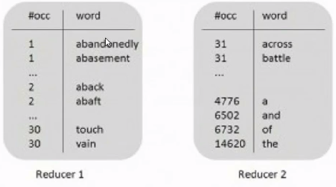
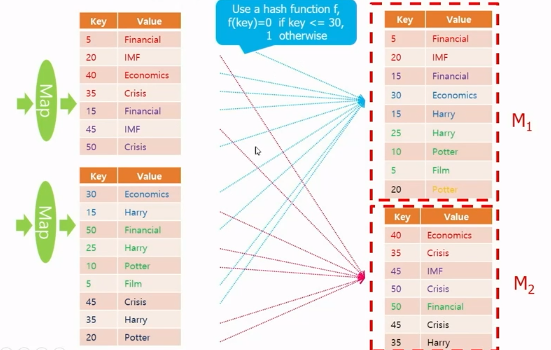
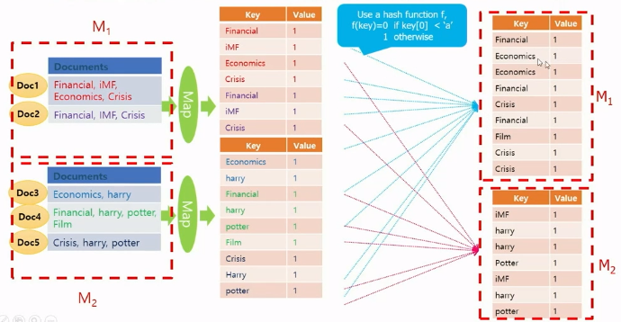
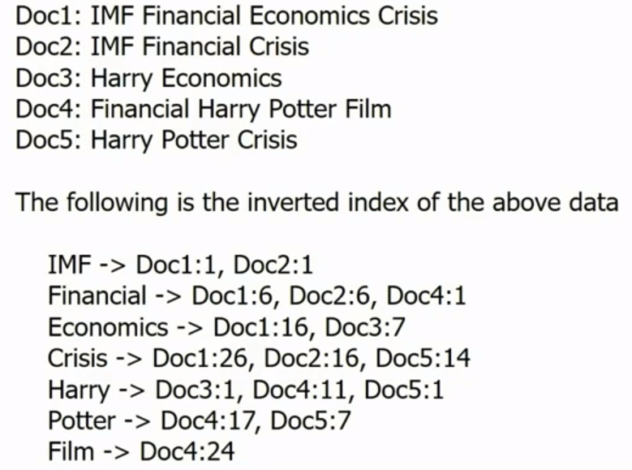
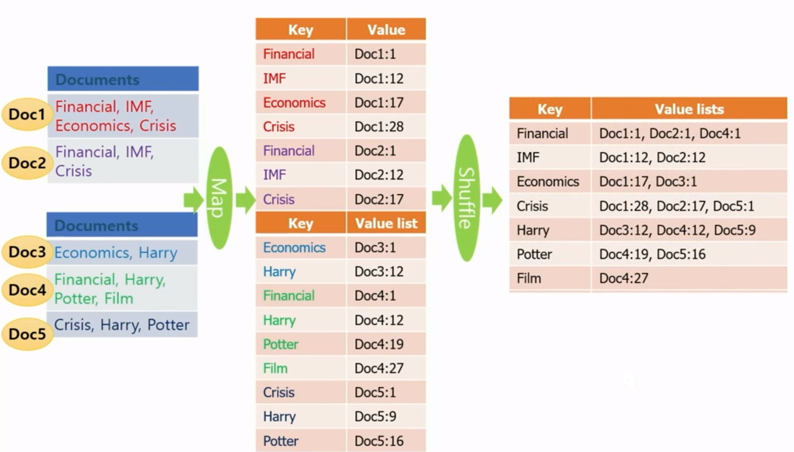
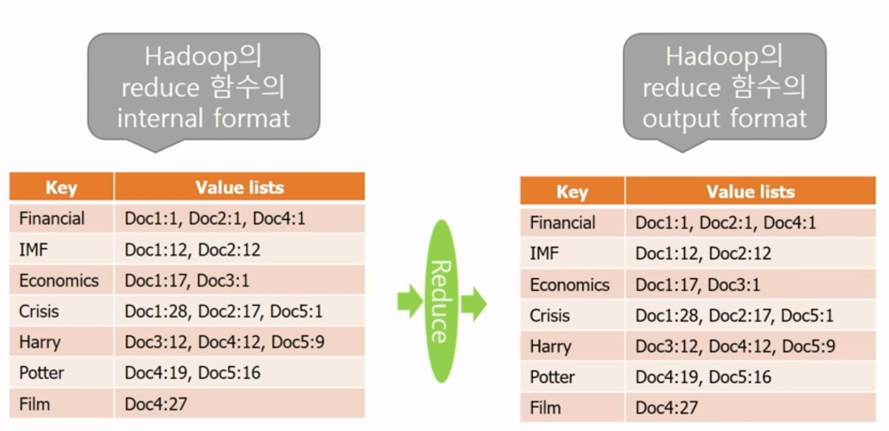
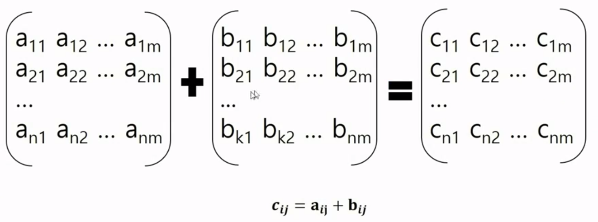
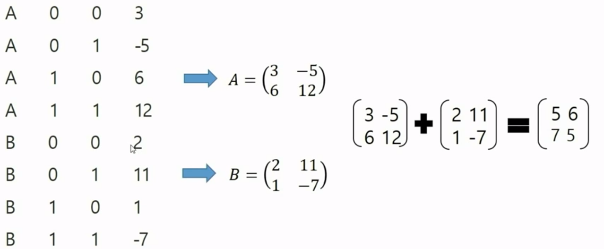
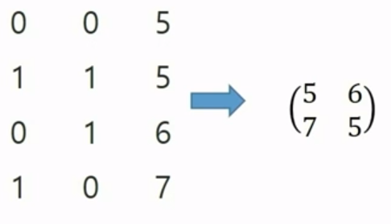
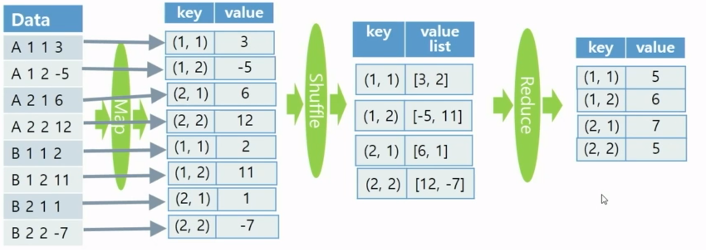

# 빅데이터 분산처리 Day2

## Partitioner Class 변경

### Partitioner Class

- Map 함수의 출력인 key-value 쌍이 key에 의해서 어느 Reducer(머신)으로 보내질 것인지 정해지는데 이러한 결정을 정의하는 클래스
- 하둡의 기본 타입은 해시함수가 Default로 제공되고 있어서 key에 대한 해시 값에 따라 어느 Reducer(머신)으로 보낼지 결정 (기본적으로 머신마다 비슷한 수가 해시값에 따라 랜덤으로 보내짐 => 파티셔너 클래스 변경은 이 방식을 바꾸는 것)
- 하둡의 기본 타입
  - Text
  - IntWritable
  - LongWritable
  - FloatWritable
  - DoubleWritable


#### 예제

- Map 함수의 출력인 key-value 쌍이 key는 IntWritable 타입, value는 Text 타입일 때 Partitioner를 수정하여 아래와 같이 각 reducer에 가게하려면 Partitioner class를 수정해야함 

- default는 IntWritable타입이고 Reducer가 두개면 나머지 연산 %2를 하여 홀수 key, 짝수 key로 나뉠 것

- 홀수 짝수로 나뉘면 전체를 보고 싶을 때 머지 후에 소팅하는 과정 필요

- 아래 그림처럼 보내면 Reducer1과 Reducer2를 concatenation 하면 됨

  

  Partitioner를 수정해서 key가 1~30이면 Reducer1으로 나머지는 Reducer2로 보낸다




##### MyPartitioner for IntWritable

- code

```java
// Partitioner를 상속받아 MyPartitioner 생성
public static class MyPartitioner extends Partitioner<IntWritable, Text> {
    @Override
    // 상당히 하드 코딩된 파티셔닝 함수, 이해를 위해 이렇게 쓴 것 원래 이렇게 쓰지 않음
    public int getPartition(IntWritable key, Text value, int numPartitions) {
        // key의 값을 뽑아냄
        int nbOccurences = key.get();  // key에 있는 IntWritable을 Java int 타입으로 get
        if(nbOccurences <= 30) return 0;  // 0번 머신
        else return 1;  // 1번 머신
    }
}
```

- Main 함수에 다음을 추가
  - `job.setPartitionerClass(MyPartitioner.class);`
- Partitioner class를 import
  - `import org.apache.hadoop.mapreduce.Partitioner;`


##### MyPartitioner Class

- WordCount.java를 수정하여 Wordcountsort.java 파일 생성

  - Reducer의 개수를 2개로 설정
  - 각 단어의 첫 글자가 ASCII 코드 순서로 a보다 앞에 오는 경우(대문자) reducer 0으로 (part-r-00000)
  - 나머지(소문자 알파벳 등)sms reducer 1로 (part-r-00001).

  

- 필요한 함수

  - value.toString()
    - 하둡의 Text 타입에서 Java의 string 타입으로 변환하여 return
  - charAt(0)
    - 첫번째 character를 return

  

- Project/src/Driver.java 수정
  - pgd.addClass("wordcountsort", Wordcountsort.class, "A map/reduce program that output frequency of the words in the input files by alphabetical order."); 
- Project 디렉토리에서
  - ant 실행
  - `$ hdfs dfs -rm -r wordcount_test_out` (리듀스 함수 출력 디렉토리 삭제 => 이미 디렉토리 있다면 삭제해야함)
  - `$ hadoop jar 패키지이름.jar wordcountsort wordcount_test wordcount_test_out`
  - `$ hdfs dfs -cat wordcount_test_out/part-r-00000|more`
  - `$ hdfs dfs -cat wordcount_test_out/part-r-00001|more`
- Reduce 마다 결과가 만들어지기 때문에 모든 결과를 봐야함

  

## Inverted Index 생성

### 예제



- 해당 단어가 몇번째 파일 몇번째 위치에 있는지 Inverted Index






- Wordcount.java를 수정하여 inverted index를 생성하는 코드를 InvertedIndex.java 파일로 생성

- 입력 파일

  - 일반 텍스트

- 출력 파일

  - 단어: <tab>파일이름: 오프셋, 파일이름:오프셋, 파일이름: 오프셋
  - 예시)

  ```
  this:	wordcount-data.txt:11, wordcount-data.txt:32
  that:	wordcount-data.txt:43, wordcount-data.txt:3
  ```

- Project/src/Driver.java 수정

  - pgd.addClass("inverted", InvertedIndex.class, "A map/reduce program that generates the inverted index using words in the input files."); 

- Project 디렉토리에서

  - ant 실행
  - `$ hdfs dfs -rm -r wordcount_test_out` (리듀스 함수 출력 디렉토리 삭제 => 이미 디렉토리 있다면 삭제해야함)
  - `$ hadoop jar 패키지이름.jar inverted wordcount_test invertedindex_test_out`
  - `$ hdfs dfs -cat invertedindex_test_out/part-r-00000|more`
  - `$ hdfs dfs -cat invertedindex_test_out/part-r-00001|more`

- Reduce 마다 결과가 만들어지기 때문에 모든 결과를 봐야함


#### 필요한 함수

- String Tokenizer: StringTokenizer(value.toString());

  - new StringTokenizer(value.toString(), "", true);
  - 단어 단위로 자르기

  

- Long: ((LongWritable)key).get();

  - 파일에서 현재 라인의 시작 위치의 byte offset을 가져옴
  - import org.apache.hadoop.io.LongWritable

  

- filename+":"+p;

  - 파일명과 현재 위치를 concatenate

  

- token.length()

  - String 타입의 변수인 token의 length를 얻음
  - 다음 단어의 위치를 계산하기 위해 알아야함

  

- 입력 파일 이름을 알아내는 방법

  - import org.apache.hadoop.mapreduce.lib.input.FileSplit;

  - ```java
    private String filename;  // Mapper 내부에서 선언
    protected void setup(Context context) throws IOException, InterruptedException {
        // 현재 사용하는 파일 이름을 추출함
        // 현재 Map함수가 호출된 데이터 파일이름을 return
        filename = ((FileSplit)context.getInputSplit()).getPath().getName();
    }
    ```

    

- InvertedIndex.java - Map

```java
import org.apache.hadoop.mapreduce.lib.input.FileSplit;

public static class TokenizerMapper
			extends Mapper<Object,Text,Text,Text> {

		// variable declairations
        // final => 값 변경 X
		private Text word = new Text();

		// map function (Context -> fixed parameter)
		public void map(Object key, Text value, Context context)
				throws IOException, InterruptedException {

			StringTokenizer itr = new StringTokenizer(value.toString());
            // 현재 위치가 시작 지점에서 몇 byte인지 계산
			while ( itr.hasMoreTokens() ) {
                // 다음 단어 가져오기
				word.set(다음 단어 set);
                // 파일 이름과 현재 위치를 value에 저장
				context.write(word, 파일 이름과 현재 위치를 저장한 value);
			}
		}
    	// filename 가져오기 위해 setup함수 정의
    	private String filename;  // Mapper 내부에서 선언
        protected void setup(Context context) throws IOException, InterruptedException {
            // 현재 사용하는 파일 이름을 추출함
            // 현재 Map함수가 호출된 데이터 파일이름을 return
            filename = ((FileSplit)context.getInputSplit()).getPath().getName();
        }
	}
```


- InvertedIndex.java - Reduce

```java
public static class IntSumReducer
			extends Reducer<Text,IntWritable,Text,Text> {

		// variables
		private IntWritable result = new IntWritable();

		public void reduce(Text key, Iterable<IntWritable> values, Context context) 
				throws IOException, InterruptedException {

			// string을 계속 붙여 나갈 string variable 선언
			for ( IntWritable val : values ) {
				// 위에서 선언한 string에 value를 계속 붙여 나감
			}
			// output value 저장
            // key(현재 단어), list를 출력
		}
	}
```


- InvertedIndex.java - Main

```java
public static void main(String[] args) throws Exception {
		Configuration conf = new Configuration();
		String[] otherArgs = new GenericOptionsParser(conf,args).getRemainingArgs();
		if ( otherArgs.length != 2 ) {
			System.err.println("Usage: <in> <out>");
			System.exit(2);
		}
    	// output 디렉토리를 자동으로 삭제
    	FileSystem hdfs = FileSystem.get(conf);
    	Path output = new Path(otherArgs[1]);
    	if (hdfs.exists(output))
            hdfs.delete(output, true);
    
		Job job = new Job(conf,"inverted index");
		job.setJarByClass(InvertedIndex.class);
		job.setMapperClass(TokenizerMapper.class);
		job.setReducerClass(ConcatenatorReducer.class);
		job.setOutputKeyClass(Text.class);
		job.setOutputValueClass(Text.class);
		job.setNumReduceTasks(2);

		// 입력파일 디렉토리 설정
		FileInputFormat.addInputPath(job,new Path(otherArgs[0]));
        // 출력파일 디렉토리 설정
		FileOutputFormat.setOutputPath(job,new Path(otherArgs[1]));
        // 실행
    	FileSystem.get(job.getConfiguration()).delete(new Path(otherArgs[1]), true);
		System.exit(job.waitForCompletion(true) ? 0 : 1 );
	}
}
```


- Driver.java
  - `pgd.addClass("inverted", InvertedIndex.class, "A map/reduce program that generates the inverted index using words in the input files.")` 등록


## Matrix Addition 연산




### 입력 파일

- 형식

  - 행렬이름<tab>행번호<tab>열번호<tab>원소값

  - 예시

    


### 출력 파일

- 형식

  - 행번호<tab>열번호<tab>원소값
  - 예시

  

  

### 과정



- Map 결과 => 행렬 위치와 해당 위치 값을 결과로 내보냄
- Shuffle 결과 => 위치 = key, 해당 위치에 있는 값들을 list = value
- Reduce 결과 => key는 그대로, value-list 값들을 더한 값 = value


### Map 함수

- 입력: <[A|B], i, j, value>
- 출력: <key=(i, j), value=[A<sub>ij</sub>|B<sub>ij</sub>]>


### Reduce 함수

- 입력: <key, value-list={A<sub>ij</sub>|B<sub>ij</sub>}>
- 출력: <key=(i, j), value=A<sub>ij</sub>+B<sub>ij</sub>>


### 예제

- MatrixAdd.template.java를 수정하여 matrix addtion 하는 코드를 MatrixAdd.java 파일로 작성
- Project/src/Driver.java 수정
  - `pgd.addClass("matadd", MatrixAdd.class, "A map/reduce program that computes the addtion of two matrixes."); `
- Project 디렉토리에서

  - ant 실행
  - `$hdfs dfs -mkdir matadd_test`
  - `$ hdfs dfs -put data/matadd-data-2x2.txt matadd_test` 
  - `$ hadoop jar 패키지이름.jar matadd matadd_test matadd_test_out`
  - `$ hdfs dfs -cat matadd_test_out/part-r-00000|more`
  - `$ hdfs dfs -cat matadd_test_out/part-r-00001|more`

- Reduce 마다 결과가 만들어지기 때문에 모든 결과를 봐야함


#### 필요한 함수

- String[] split(String delimeter)
  - String class의 member method
  - String을 delimeter로 분리하여 array에 넣어 return
  - String[] arr = tmpStr.split("\t");


### MatrixAdd.template.java 코드

```java
package ssafy;

import java.io.IOException;
import java.util.StringTokenizer;

import org.apache.hadoop.conf.Configuration;
import org.apache.hadoop.fs.Path;
import org.apache.hadoop.fs.FileSystem;
import org.apache.hadoop.io.IntWritable;
import org.apache.hadoop.io.Text;
import org.apache.hadoop.mapreduce.Job;
import org.apache.hadoop.mapreduce.Mapper;
import org.apache.hadoop.mapreduce.Reducer;
import org.apache.hadoop.mapreduce.lib.input.FileInputFormat;
import org.apache.hadoop.mapreduce.lib.output.FileOutputFormat;
import org.apache.hadoop.util.GenericOptionsParser;

public class MatrixAdd {
  public static class MAddMapper  extends  Mapper<Object, Text, Text , IntWritable>{

     public void map(Object key, Text value, Context context)
	throws IOException, InterruptedException {
  		// [A|B] row_num col_num value 형식으로 들어오는 데이터를 parsing 해서 key-value 쌍ㅇ을 내보낸다

     }
  }
  public static class  MAddReducer  extends Reducer<Text, IntWritable, Text, IntWritable> {
    public void reduce(Text  key, Iterable<IntWritable> values, Context  context) 
	throws IOException, InterruptedException {

		// value-list에 들어있는 값을 이용해 결과 행렬의 각 원소 값을 내보낸다


    }
  }

  public static void main(String[] args) throws Exception {
    Configuration conf = new Configuration();
    String[] otherArgs = new GenericOptionsParser(conf, args).getRemainingArgs();
    if (otherArgs.length != 2) {	// "hadoop jar jarname.jar 프로그램명"을 제외한 변수를 저장
      System.err.println("Usage: <in> <out>");
      System.exit(2);
    }
    FileSystem hdfs = FileSystem.get(conf);
    Path output = new Path(otherArgs[1]);
    if (hdfs.exists(output))
            hdfs.delete(output, true);

    Job job = new Job(conf, "matrix addition");
    job.setJarByClass(MatrixAdd.class);		// class 명 설정
    job.setMapperClass(MAddMapper.class);	               // Map class 설정
    job.setReducerClass(MAddReducer.class);	               // Reduce class 설정
    job.setOutputKeyClass(Text.class);		// output key type 설정
    job.setOutputValueClass(IntWritable.class);		// output value type 설정
    job.setNumReduceTasks(2);			// 동시에 실행되는 reduce개수 설정

    FileInputFormat.addInputPath(job, new Path(otherArgs[0]));	// 입력파일 디렉토리 설정
    FileOutputFormat.setOutputPath(job, new Path(otherArgs[1]));	// 출력파일 디렉토리 설정
    System.exit(job.waitForCompletion(true) ? 0 : 1);	// 실행
  }
}
```


